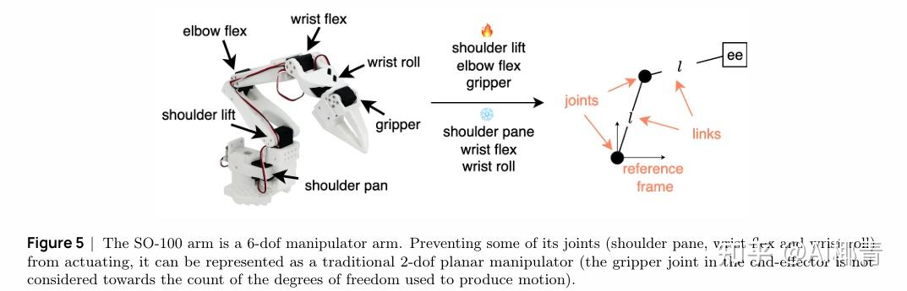
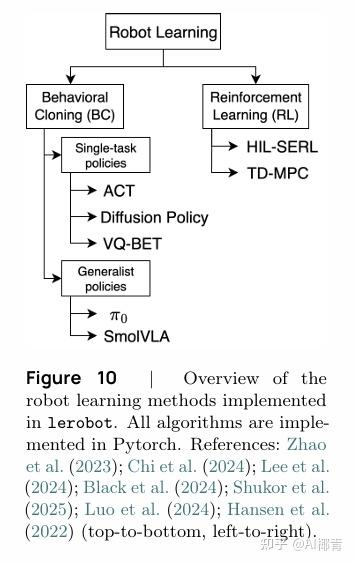
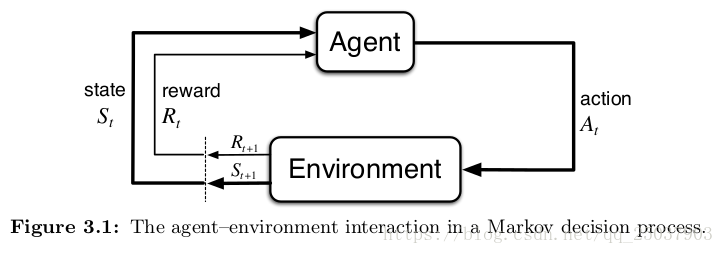
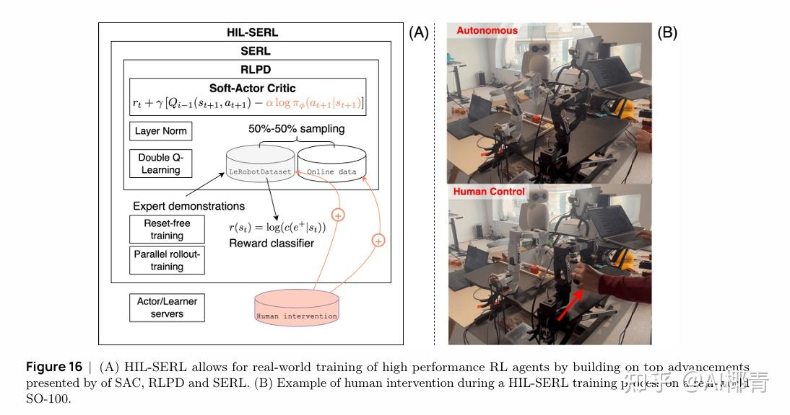
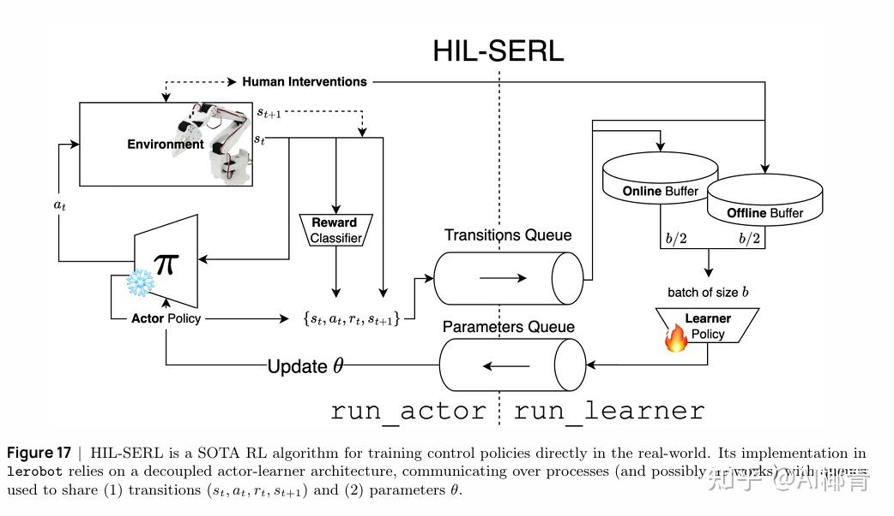

#  <center>RL</center>

## 安装与运行

离线运行
lerobot-dataset-viz  --repo-id lerobot/pusht   --root /home/ahpc/.cache/huggingface/lerobot/lerobot/pusht   --mode local  --episode-index 0

问题：运行命令python -m lerobot.rl.gym_manipulator --config_path path/to/gym_hil_env.json报错 ImportError: numpy.core.multiarray failed to import
解决方法：pip install opencv-python==4.12.0.88

打开仿真环境，在配置文件设置如下：
1、mode = null
2、PandaPickCubeBase-v0: Basic environment
   PandaPickCubeGamepad-v0: With gamepad control   蓝牙手柄
   PandaPickCubeKeyboard-v0: With keyboard control 键盘
python -m lerobot.rl.gym_manipulator --config_path /home/ahpc/RL/sim_test/configs/gym_hil_env.json
出现查找不到设备的时候崩溃现象，修改如下：
```C++
   # Get action features from teleop device or environment action space
   if teleop_device is not None:
      action_features = teleop_device.action_features
   else:
      # For gym_hil environments without teleop device, derive from action space
      action_space = env.action_space
      print("Action space:", action_space)
      action_features = {
            "dtype": "float32",
            "shape": action_space.shape,
            "names": None,
      }
```
需要键盘控制的时候需要先按下**空格健**使能控制
Keyboard controls:
  Arrow keys: Move in X-Y plane
  Shift and Shift_R: Move in Z axis
  Right Ctrl and Left Ctrl: Open and close gripper
  Enter: End episode with SUCCESS
  Backspace: End episode with FAILURE
  Space: Start/Stop Intervention
  ESC: Exit


## 传统机器人技术
参考知乎[机器学习](https://zhuanlan.zhihu.com/p/1961959949446936245)
### 显式模型与隐式模型
机器人运动生成方法的范围从传统显式模型（**即基于动力学的方法**）到隐式模型（**即基于学习的方法**）：前者利用机器人刚体力学及其与环境中潜在障碍物交互的精确描述；后者则将人工运动视为在给定多个感觉运动读数时需要学习的统计模式。
要理解为何基于学习的方法在机器人社区中日益流行，需要简要分析操作任务的传统方法——这些方法利用正运动学（FK）、逆运动学（IK）和控制理论等工具。



### 基于动力学的机器人技术的局限性
但自主机器人在物理世界中仍远不能以人类水平的性能完成任务，尤其在（1）跨机器人载体（不同操作器、不同运动平台等）和（2）跨任务（系鞋带、操作多种物体等）的泛化能力方面存在显著不足。上述基于动力学的方法虽在机器人技术早期发展中至关重要，但在实际应用中需要大量人类专业知识，且通常仅针对特定应用问题设计。

基于动力学的机器人技术流水线历来采用“顺序开发”模式：如今大多数架构中的不同模块（**传感、状态估计、映射、规划、（微分）逆运动学、底层控制**），最初都是为特定用途独立开发的，且接口固定。将这些专用模块组装成流水线的过程容易出错：当发生变化时（例如，传感环节的光照变化、传感器遮挡/故障、控制失效），系统会表现出脆性，且误差会不断累积。要将这样的技术栈适配到新任务或新机器人平台，往往需要在多个阶段重新定义目标、约束和启发式规则，导致巨大的工程开销

综合来看，这些局限性推动了对基于学习方法的探索——这类方法能够（1）更紧密地集成感知与控制；（2）减少专家建模干预，实现跨任务和跨载体的自适应；（3）随着更多机器人数据的可得，性能能够平稳扩展

## Robot(Reinforcement)Learning
基于学习的方法可完全绕过显式建模，仅依赖交互数据即**依赖一体化的“预测-动作”流水线（视觉运动策略）**——————这一优势在动力学难以建模或完全未知的场景中具有变革性。最后，机器人学习（Robot Learning）天生适合利用日益增多的开放可用机器人数据，正如计算机视觉和自然语言处理领域历史上从大规模语料库中获益那样，而这在很大程度上被基于动力学的方法所忽视。
作为一个相对新兴的领域，机器人学习尚未出现某种技术明显优于其他技术的局面。尽管如此，有两类方法已获得广泛关注：RL和行为克隆（Behavior Clone ,BC）
   

通用机器人模型与单任务行为克隆方法并列呈现。尽管从本质上看，二者存在显著差异——通用模型受语言条件约束，可通过指令生成适用于多种任务的运动；而单任务模型通常不受语言条件约束，仅用于执行单一任务——但基础模型的训练在很大程度上仍依赖于“从（大型）输入演示训练集中复现轨迹”。因此，我们认为通用策略确实可与其他单任务行为克隆方法归为一类，因为它们均采用相似的训练数据和模式。

列出了当前lerobot中可用的所有机器人学习策略：基于Transformer的动作分块（ACT）、扩散策略（Diffusion Policy）、向量量化行为Transformer（VQ-BeT）、SmolVLA、人在环样本高效强化学习（HIL-SERL）以及TD-MPC。

### 强化学习（简明）介绍
强化学习是机器学习的一个子领域，核心目标是agent（智能体）在进行某个任务action时（决策），首先与environment进行交互，产生新的状态state，同时环境给出奖励reward，如此循环下去，agent和environment不断交互产生更多新的数据。强化学习算法就是通过一系列动作策略与环境交互，产生新的数据，再利用新的数据去修改自身的动作策略，经过数次迭代后，agent就会学习到完成任务所需要的动作策略。


形式上，智能体与环境之间的交互通常通过**马尔可夫决策过程（MDP） 建模**。将机器人问题通过马尔可夫决策过程表示具有多项优势，包括（1）通过其固有的随机形式纳入不确定性；（2）为“无需环境动力学显式模型的学习”提供理论严谨的框架。尽管马尔可夫决策过程也可支持连续时间形式，但在强化学习中通常考虑离散时间场景，假设交互在离散时间步t = 0,1,2,3,4.....T发生。允许无限次交互（$T\rightarrow\infty$）的马尔可夫决策过程被称为“无限时域”（infinite-horizon）马尔可夫决策过程，与之相对的是“有限时域”（finite-horizon）马尔可夫决策过程（T为有限值）。除非特别说明，本文仅讨论离散时间有限时域（ episodic，片段式）马尔可夫决策过程。
长度为T的马尔可夫决策过程（MDP）是一个元组，有如下定义：
S为状态空间；$s_t\in S$表示时间t时环境的状态。在机器人技术中，状态通常包括机器人配置，还可包含传感器读数（如摄像头或音频流）；
A为动作空间；$a_t \in A$可表示t时间步时的关节力矩、关节速度，甚至末端执行器指令。通常，动作对应于“干预机器人配置的指令”；
D表示（可能非确定性的）环境动力学，有$D(s_t,a_t,s_{t+1}) = P(s_{t+1}| s_t,a_t)$,表示从一个状态转移到另一个状态的概率分布，例如，对于平面操作机器人，当环境被完全描述时（图6a），动力学可视为确定性的；而当存在依赖未观测参数的未建模干扰时（图7），动力学则具有随机性；
r为奖励函数，描述了在状态$s_t$下执行$a_t$的期望即时奖励$r(s_t,a_t,s_{t+1})$,例如，对于“沿x轴快速移动”这一任务，简单的奖励函数可基于机器人沿x轴的绝对位置（$p_{x_t}$），对摔倒行为（通过$p_{z_t}$衡量）引入负惩罚，并对速度$\dot{p}_{x_t}$引入奖励，即$r(s_t,a_t,s_{t+1}) = p_{x_t}\dot{p}_{x_t} - frac{1}{p_{z_t}}$；
$\gamma$为折扣因子，用于调节对**即时奖励与长期奖励的偏好**
轨迹（trajectory）是一个（随机的）序列，定义为：
$$
\tau = (s_0,a_0,a_0,s_1,a_1,a_1,...s_{T-1},a_{T-1},a_{T-1},s_T)
$$
为简化符号，将每一步的奖励定义为$r_t = (s_t,a_t,s_{t+1})$,有趣的是，假设"环境动力学"和“给定状态下动作的条件分布”（即策略）均满足马尔可夫性质：
$$
P(s_{t+1}| s_t,a_t)  = P(s_{t+1}| s_t,a_t,s_{t-1},a_{t-1},...,s_0,a_0)\\
P(a_t | s_t )= P(a_t | s_t,s_{t-1},...,s_0)
$$
则观测到某一轨迹$\tau$的概率可分解为：
$$
P(\tau) = P(s_0)\prod_{t=0}^{T}P(s_{t+1}| s_t,a_t)P(a_t | s_t )
$$
策略$P(a_t | s_t )$通常记为$\pi(a_t | s_t )$，且常通过参数$\theta$参数化，即$\pi_{\theta}(a_t | s_t )$。策略的训练目标是优化某一轨迹相关的（折扣）回报——即任意轨迹上测量奖励的（随机）总和：
$$
G(\tau) = \sum_{t = 0}^T\gamma^tr_t
$$
**回报（return）**可以定义为奖励的逐步叠加，假设时刻$t$后的奖励序列为$r_{t+1},r_{t+2},r_{t+3},\cdots$，则回报为
$$
  G_{t}=r_{t+1}+\gamma r_{t+2}+\gamma^{2} r_{t+3}+\gamma^{3} r_{t+4}+\ldots+\gamma^{T-t-1} r_{T}
$$
其中，$T$是最终时刻，$\gamma$ 是折扣因子，越往后得到的奖励，折扣越多。这说明我们更希望得到现有的奖励，对未来的奖励要打折扣。当我们有了回报之后，就可以定义状态的价值了，就是**状态价值函数（state-value function）**。对于马尔可夫奖励过程，状态价值函数被定义成回报的期望，即
$$
\begin{aligned}
    V^{t}(s) &=\mathbb{E}\left[G_{t} \mid s_{t}=s\right] \\
    &=\mathbb{E}\left[r_{t+1}+\gamma r_{t+2}+\gamma^{2} r_{t+3}+\ldots+\gamma^{T-t-1} r_{T} \mid s_{t}=s\right]
\end{aligned}  
$$
其中，$G_t$ 是之前定义的**折扣回报（discounted return）**。我们对$G_t$取了一个期望，期望就是从这个状态开始，我们可能获得多大的价值。所以期望也可以看成未来可能获得奖励的当前价值的表现，就是当我们进入某一个状态后，我们现在有多大的价值。
#### 贝尔曼方程

但是这里我们采取了另外一种计算方法，从价值函数里面推导出**贝尔曼方程（Bellman equation）**：
$$
  V(s)=\underbrace{R(s)}_{\text {即时奖励}}+\underbrace{\gamma \sum_{s^{\prime} \in S} p\left(s^{\prime} \mid s\right) V\left(s^{\prime}\right)}_{\text {未来奖励的折扣总和}}
$$
其中，
* $s'$ 可以看成未来的所有状态，
* $p(s'|s)$  是指从当前状态转移到未来状态的概率。
* $V(s')$ 代表的是未来某一个状态的价值。我们从当前状态开始，有一定的概率去到未来的所有状态，所以我们要把 $p\left(s^{\prime} \mid s\right)$ 写上去。我们得到了未来状态后，乘一个 $\gamma$，这样就可以把未来的奖励打折扣。
* $\gamma \sum_{s^{\prime} \in S} p\left(s^{\prime} \mid s\right) V\left(s^{\prime}\right)$ 可以看成未来奖励的折扣总和（discounted sum of future reward）。

贝尔曼方程定义了当前状态与未来状态之间的关系。**未来奖励的折扣总和加上即时奖励，就组成了贝尔曼方程**。
#### 状态价值函数与动作价值函数（Q函数）
马尔可夫决策过程中的状态价值函数可定义为
$$
V_{\pi}(s)=\mathbb{E}_{\pi}\left[G_{t} \mid s_{t}=s\right] \tag{2.3}
$$
可以理解为**在某个状态下回报的期望**

这里我们另外引入了一个 **Q 函数（Q-function）**。Q 函数也被称为**动作价值函数（action-value function）**。Q 函数定义的是**在某一个状态采取某一个动作，它有可能得到的回报的一个期望**，即
$$
Q_{\pi}(s, a)=\mathbb{E}_{\pi}\left[G_{t} \mid s_{t}=s, a_{t}=a\right] \tag{2.4}
$$
这里的期望其实也是基于策略函数的。所以我们需要对策略函数进行一个加和，然后得到它的价值。
对 Q 函数中的动作进行加和，就可以得到状态价值函数：
$$
V_{\pi}(s)=\sum_{a \in A} \pi(a \mid s) Q_{\pi}(s, a)
\tag{2.5}
$$
#### 贝尔曼期望方程

我们可以把状态价值函数和 Q 函数拆解成两个部分：即时奖励和后续状态的折扣价值（discounted value of successor state）。
通过对状态价值函数进行分解，我们就可以得到一个类似于之前马尔可夫奖励过程的贝尔曼方程————**贝尔曼期望方程（Bellman expectation equation）**：
$$
  V_{\pi}(s)=\mathbb{E}_{\pi}\left[r_{t+1}+\gamma V_{\pi}\left(s_{t+1}\right) \mid s_{t}=s\right] \tag{2.6} 
$$

对于 Q 函数，我们也可以做类似的分解，得到 Q 函数的贝尔曼期望方程：
$$
  Q_{\pi}(s, a)=\mathbb{E}_{\pi}\left[r_{t+1}+\gamma Q_{\pi}\left(s_{t+1}, a_{t+1}\right) \mid s_{t}=s, a_{t}=a\right] \tag{2.7}
$$
贝尔曼期望方程定义了当前状态与未来状态之间的关联。

#### 贝尔曼最优方程

当我们一直采取 arg max 操作的时候，我们会得到一个单调的递增。通过采取这种贪心操作（arg max 操作），我们就会得到更好的或者不变的策略，而不会使价值函数变差。我们取让 Q 函数值最大化的动作，Q 函数就会直接变成价值函数，即
$$
  Q_{\pi}\left(s, \pi^{\prime}(s)\right)=\max _{a \in A} Q_{\pi}(s, a)=Q_{\pi}(s, \pi(s))=V_{\pi}(s)
$$

我们也就可以得到**贝尔曼最优方程（Bellman optimality equation）**
$$
  V_{\pi}(s)=\max _{a \in A} Q_{\pi}(s, a)
$$
贝尔曼最优方程表明：最佳策略下的**一个状态的价值必须等于在这个状态下采取最好动作得到的回报的期望**。 当马尔可夫决策过程满足贝尔曼最优方程的时候，整个马尔可夫决策过程已经达到最佳的状态。

#### 马尔可夫决策过程中的预测和控制总结
总结如表 2.1 所示，我们使用动态规划算法来解马尔可夫决策过程里面的预测和控制，并且采取不同的贝尔曼方程。对于预测问题，即策略评估的问题，我们不停地执行贝尔曼期望方程，这样就可以估计出给定的策略，然后得到价值函数。对于控制问题，如果我们采取的算法是策略迭代，使用的就是贝尔曼期望方程；如果我们采取的算法是价值迭代，使用的就是贝尔曼最优方程。


#### 有模型与免模型的区别 
当马尔可夫决策过程的模型未知或者模型很大时，我们可以使用免模型强化学习的方法。免模型强化学习方法没有获取环境的状态转移和奖励函数，而是让智能体与环境进行交互，采集大量的轨迹数据，智能体从轨迹中获取信息来改进策略，从而获得更多的奖励。

#### Q表格
在多次尝试和熊打交道之后，我们就可以对熊的不同的状态做出判断，用状态动作价值来表达在某个状态下某个动作的好坏。后续能够获得多少总奖励。如果可以预估未来的总奖励的大小，我们就知道在当前的状态下选择哪个动作价值更高。
如图 3.6 所示，如果 **Q 表格**是一张已经训练好的表格，这张表格就像是一本生活手册。通过查看这本手册，我们就知道在熊发怒的时候，装死的价值会高一点；在熊离开的时候，我们偷偷逃跑会比较容易获救。


#### 免模型预测方法
在无法获取马尔可夫决策过程的模型情况下，我们可以通过**蒙特卡洛方法和时序差分方法**来估计某个给定策略的价值。
##### 蒙特卡洛策略评估
**蒙特卡洛**方法是基于采样的方法，给定策略 $\pi$，我们让智能体与环境进行交互，可以得到很多轨迹。每个轨迹都有对应的回报：

$$
G_{t}=r_{t+1}+\gamma r_{t+2}+\gamma^{2} r_{t+3}+\ldots
$$

我们求出所有轨迹的回报的平均值，就可以知道某一个策略对应状态的价值，即 
$$
V_{\pi}(s)=\mathbb{E}_{\tau \sim \pi}\left[G_{t} \mid  s_{t}=s\right]
$$

蒙特卡洛仿真是指我们可以采样大量的轨迹，计算所有轨迹的真实回报，然后计算平均值。蒙特卡洛方法使用经验平均回报（empirical mean return）的方法来估计，它不需要马尔可夫决策过程的状态转移函数和奖励函数，并且不需要像动态规划那样用自举的方法。此外，蒙特卡洛方法有一定的局限性，它只能用在有终止的马尔可夫决策过程中。
##### 时序差分方法
**时序差分方法**的目的是对于某个给定的策略 $\pi$，在线（online）地算出它的价值函数 $V_{\pi}$，即一步一步地（step-by-step）算。
最简单的算法是**一步时序差分（one-step TD）**，即TD(0)。每往前走一步，就做一步自举，用得到的估计回报（estimated return）$r_{t+1}+\gamma V(s_{t+1})$ 来更新上一时刻的值 $V(s_t)$：
$$
  V\left(s_{t}\right) \leftarrow V\left(s_{t}\right)+\alpha\left(r_{t+1}+\gamma V\left(s_{t+1}\right)-V\left(s_{t}\right)\right) \tag{3.1}
$$
估计回报 $r_{t+1}+\gamma V(s_{t+1})$ 被称为**时序差分目标（TD target）**，
时序差分目标是带衰减的未来奖励的总和。时序差分目标由两部分组成：

（1）我们走了某一步后得到的实际奖励$r_{t+1}$；

（2）我们利用了自举的方法，通过之前的估计来估计 $V(s_{t+1})$  ，并且加了折扣因子，即 $\gamma V(s_{t+1})$。


时序差分目标是估计有两个原因：

（1）时序差分方法对期望值进行采样；

（2）时序差分方法使用当前估计的 $V$ 而不是真实的 $V_{\pi}$。

**时序差分误差（TD error）** $\delta=r_{t+1}+\gamma V(s_{t+1})-V(s_t)$。
类比增量式蒙特卡洛方法，给定一个回合 $i$，我们可以更新 $V(s_t)$ 来逼近真实的回报 $G_t$，具体更新公式为
$$
V\left(s_{t}\right) \leftarrow V\left(s_{t}\right)+\alpha\left(G_{i, t}-V\left(s_{t}\right)\right)
$$
式(3.1)体现了强化的概念。

#### 免模型控制  

在我们不知道马尔可夫决策过程模型的情况下，如何优化价值函数，得到最佳的策略呢？我们可以把策略迭代进行广义的推广，使它能够兼容蒙特卡洛和时序差分的方法，即带有蒙特卡洛方法和时序差分方法的**广义策略迭代（generalized policy iteration，GPI）**。

如图 3.23 所示，策略迭代由两个步骤组成。第一，我们根据给定的当前策略 $\pi$ 来估计价值函数；第二，得到估计的价值函数后，我们通过贪心的方法来改进策略，即
$$
\pi^{'}=\text{贪心函数}(V_{\pi})
$$

这两个步骤是一个互相迭代的过程。

$$
\pi_{i+1}(s)=\underset{a}{\arg \max } Q_{\pi_{i}}(s, a) \tag{3.3}
$$

我们可以计算出策略 $\pi$ 的动作价值函数，并且可以根据式（3.3）来计算针对状态 $s \in S$ 的新策略 $\pi_{i+1}$。但得到状态价值函数后，我们并不知道奖励函数 $R(s,a)$ 和状态转移 $P(s'|s,a)$，所以就无法估计 Q 函数
$$
Q_{\pi_{i}}(s, a)=R(s, a)+\gamma \sum_{s^{\prime} \in S} P\left(s^{\prime} \mid s, a\right) V_{\pi_{i}}\left(s^{\prime}\right)
$$

##### Q学习：异策略时序差分控制 

Q学习是一种**异策略（off-policy）**算法。如图 3.31 所示，异策略在学习的过程中，有两种不同的策略：**目标策略（target policy）**和**行为策略（behavior policy）**。
**目标策略**是我们需要去学习的策略，一般用 $\pi$ 来表示。目标策略就像是在后方指挥战术的一个军师，它可以根据自己的经验来学习最优的策略，不需要去和环境交互。
**行为策略**是探索环境的策略，一般用 $\mu$ 来表示。行为策略可以大胆地去探索到所有可能的轨迹，采集轨迹，采集数据，然后把采集到的数据“喂”给目标策略学习。而且“喂”给目标策略的数据中并不需要 $a_{t+1}$ ，而 Sarsa 是要有 $a_{t+1}$ 的。行为策略像是一个战士，可以在环境里面探索所有的动作、轨迹和经验，然后把这些经验交给目标策略去学习。比如目标策略优化的时候，Q学习不会管我们下一步去往哪里探索，它只选取奖励最大的策略。

### 机器人的真实世界强化学习
端到端的简化控制流水线、数据驱动的特征提取、“无需显式建模而依赖交互数据”——这些都是机器人强化学习的核心特征。然而，强化学习在安全性和学习效率方面仍存在局限性，这对真实世界机器人应用而言尤为关键。    

（1）首先，尤其在训练初期，智能体的动作通常具有探索性，可能表现出随机性。在物理系统上，未训练完成的策略可能会发出“高速度、自碰撞配置或超过关节极限的力矩”等指令，导致设备磨损甚至硬件损坏。要降低这些风险，需引入外部保护机制（如监控器、安全监测器、紧急停止装置），而这往往需要大量人工监督。
（2）此外，在大多数机器人问题采用的“片段式训练”场景中，训练过程中需手动重置环境，这一过程耗时且易出错，大幅降低了实验效率。其次，强化学习的“样本效率低”问题仍未解决——由于训练时间过长，限制了其在真实世界机器人中的适用性。即使是SAC等性能优良的算法，通常也需要大量的状态转移样本；而在真实硬件上生成这些数据非常耗时。     

在模拟器中训练强化学习策略可同时解决上述两个问题：既消除了物理风险，又大幅提高了数据生成效率。
（1）然而，构建和维护“真实世界问题的高保真模拟器”难度极大——尤其对于“接触密集型操作”和“涉及可变形或软材料的任务”。
（2）奖励设计是真实世界强化学习流水线中“脆弱性”的另一个重要来源。尽管为“长时域任务中的探索引导”设计密集奖励通常是必要的，但这一过程易出错且严重依赖人类专业知识和直觉。设计不当的奖励项可能导致“策略投机”（specification gaming）或收敛到局部最优；
通过“从大量人类演示中学习”的行为克隆（BC）技术的进步，可同时解决上述两个问题。尽管行为克隆存在“固有次优性”（模仿学习的性能最多只能与演示者持平），但“通过行为克隆复现专家演示”的方法已被证明具有越来越强的竞争力和实用性——无需依赖仿真环境，也无需设计难以定义的奖励函数。


### 代码示例：真实世界强化学习
从高层架构看，HIL-SERL（图17）依赖两个核心组件：
执行器（Actor）：运行“冻结的策略网络”以与环境交互并获取观测。观测既用于“约束冻结执行器选择待执行动作”，也用于构建状态转移样本$(s_t,a_t,r_t,s_{t+1})$，并与学习器共享。奖励通过“基于离线演示数据集训练的自定义奖励分类器”推断得到。
学习器（Learner）：用于优化策略参数$\theta$，以最大化期望回报。学习器从在线和离线缓冲区中按等比例采样批量数据，并将更新后的参数共享给执行器。
本示例中的HIL-SERL架构可在本地运行，而lerobot的实现还支持“执行器和学习器在两台通过网络连接的机器上分别运行”。
