#  <center>RL</center>

## 安装与运行

离线运行
lerobot-dataset-viz  --repo-id lerobot/pusht   --root /home/ahpc/.cache/huggingface/lerobot/lerobot/pusht   --mode local  --episode-index 0

问题：运行命令python -m lerobot.rl.gym_manipulator --config_path path/to/gym_hil_env.json报错 ImportError: numpy.core.multiarray failed to import
解决方法：pip install opencv-python==4.12.0.88

打开仿真环境，在配置文件设置如下：
1、mode = null
2、PandaPickCubeBase-v0: Basic environment
   PandaPickCubeGamepad-v0: With gamepad control   蓝牙手柄
   PandaPickCubeKeyboard-v0: With keyboard control 键盘
python -m lerobot.rl.gym_manipulator --config_path /home/ahpc/RL/sim_test/configs/gym_hil_env.json
出现查找不到设备的时候崩溃现象，修改如下：
```C++
   # Get action features from teleop device or environment action space
   if teleop_device is not None:
      action_features = teleop_device.action_features
   else:
      # For gym_hil environments without teleop device, derive from action space
      action_space = env.action_space
      print("Action space:", action_space)
      action_features = {
            "dtype": "float32",
            "shape": action_space.shape,
            "names": None,
      }
```
需要键盘控制的时候需要先按下**空格健**使能控制
Keyboard controls:
  Arrow keys: Move in X-Y plane
  Shift and Shift_R: Move in Z axis
  Right Ctrl and Left Ctrl: Open and close gripper
  Enter: End episode with SUCCESS
  Backspace: End episode with FAILURE
  Space: Start/Stop Intervention
  ESC: Exit


```log
INFO 2025-11-24 19:15:31 ot_train.py:262 cfg.steps=100000 (100K)
INFO 2025-11-24 19:15:31 ot_train.py:263 dataset.num_frames=38759 (39K)
INFO 2025-11-24 19:15:31 ot_train.py:264 dataset.num_episodes=102
INFO 2025-11-24 19:15:31 ot_train.py:267 Effective batch size: 32 x 1 = 32
INFO 2025-11-24 19:15:31 ot_train.py:268 num_learnable_params=51597190 (52M)
INFO 2025-11-24 19:15:31 ot_train.py:269 num_total_params=51597190 (52M)
INFO 2025-11-24 19:15:31 ot_train.py:324 Start offline training on a fixed dataset
INFO 2025-11-24 19:17:53 ot_train.py:351 step:200 smpl:6K ep:17 epch:0.17 loss:5.675 grdn:90.898 lr:1.0e-05 updt_s:0.386 data_s:0.324
INFO 2025-11-24 19:20:10 ot_train.py:351 step:400 smpl:13K ep:34 epch:0.33 loss:2.394 grdn:43.751 lr:1.0e-05 updt_s:0.373 data_s:0.313
INFO 2025-11-24 19:22:28 ot_train.py:351 step:600 smpl:19K ep:51 epch:0.50 loss:1.943 grdn:39.733 lr:1.0e-05 updt_s:0.376 data_s:0.313

INFO 2025-11-25 14:19:10 ot_train.py:351 step:100K smpl:3M ep:8K epch:82.40 loss:0.039 grdn:3.930 lr:1.0e-05 updt_s:0.374 data_s:0.312
INFO 2025-11-25 14:21:27 ot_train.py:351 step:100K smpl:3M ep:8K epch:82.56 loss:0.039 grdn:3.996 lr:1.0e-05 updt_s:0.374 data_s:0.312
INFO 2025-11-25 14:21:27 ot_train.py:361 Checkpoint policy after step 100000
INFO 2025-11-25 14:21:28 ot_train.py:430 End of training
```
训练日志解读
step: 当前训练步数
smpl: 已处理的样本数
ep: 已处理的 episode 数量，episode表示从任务开始到结束的完整操作序列，可以看成数据集的一个单位，比如：
在 LeRobot 的数据集中：一个 episode 可能包含两百帧（step 0 → step 200），包括观察（image、state）、动作（action）、奖励（reward）等轨迹数据，从上面最后日志看有102 num_episodes就是已经训练过8K 次。
epch: 已处理的 epoch 数量，epoch表示训练时对整个数据集重复学习的次数（训练循环）。数据被重复利用次数，比如：
如果你有 10,000 条 demonstration（示教数据），训练 20 个 epoch，就是把这 10,000 条数据重复训练 20 遍，从上面日志看所有数据已经训练完82.56遍。
loss: 当前批次的损失值
grdn: 梯度范数
lr: 当前学习率
updt_s: 网络参数更新时间（秒）
data_s: 数据加载时间（秒）
∑rwrd: 评估回合的平均累积奖励
success: 评估回合的成功率
eval_s: 评估时间（秒）
```python
outputs/train/my_experiment/checkpoints/
├── 000100                          # 训练步数为100的检查点
│   ├── pretrained_model/           # 预训练模型目录
│   │   ├── config.json             # 策略配置
│   │   ├── model.safetensors       # 模型权重
│   │   └── train_config.json       # 训练配置
│   └── training_state/             # 训练状态目录
│       ├── optimizer_param_groups.json  # 优化器参数组
│       ├── optimizer_state.safetensors  # 优化器状态
│       ├── rng_state.safetensors        # 随机数生成器状态
│       ├── scheduler_state.json         # 学习率调度器状态
│       └── training_step.json           # 训练步数
├── 000200                          # 训练步数为200的检查点
└── last -> 000200                  # 指向最新检查点的符号链接
```
### 提高模型性能
除了基本的训练配置外，LeRobot的命令行训练工具还提供了多种高级配置选项，用于优化训练过程和提高模型性能。

学习率调整：
```shell
python lerobot/scripts/train.py \
    --dataset.repo_id=lerobot/pusht \
    --policy.type=diffusion \
    --optim.lr=5e-5 \
    --optim.weight_decay=0.01
```
这个命令设置了初始学习率为5e-5，权重衰减为0.01。

学习率调度：
```shell
python lerobot/scripts/train.py \
    --dataset.repo_id=lerobot/pusht \
    --policy.type=diffusion \
    --optim.lr=5e-5 \
    --optim.scheduler.type=cosine \
    --optim.scheduler.warmup_steps=1000
```
这个命令启用了余弦学习率调度，并设置了1000步的预热期。

混合精度训练：
```shell
python lerobot/scripts/train.py \
    --dataset.repo_id=lerobot/pusht \
    --policy.type=diffusion \
    --policy.use_amp=true
```
这个命令启用了混合精度训练，可以显著提高训练速度，同时减少内存使用。

梯度裁剪：
```shell
python lerobot/scripts/train.py \
    --dataset.repo_id=lerobot/pusht \
    --policy.type=diffusion \
    --optim.grad_clip=1.0
```
这个命令设置了梯度裁剪阈值为1.0，有助于稳定训练过程。
## 传统机器人技术
参考知乎[机器学习](https://zhuanlan.zhihu.com/p/1961959949446936245)
### 显式模型与隐式模型
机器人运动生成方法的范围从传统显式模型（**即基于动力学的方法**）到隐式模型（**即基于学习的方法**）：前者利用机器人刚体力学及其与环境中潜在障碍物交互的精确描述；后者则将人工运动视为在给定多个感觉运动读数时需要学习的统计模式。
要理解为何基于学习的方法在机器人社区中日益流行，需要简要分析操作任务的传统方法——这些方法利用正运动学（FK）、逆运动学（IK）和控制理论等工具。


### 基于动力学的机器人技术的局限性
但自主机器人在物理世界中仍远不能以人类水平的性能完成任务，尤其在（1）跨机器人载体（不同操作器、不同运动平台等）和（2）跨任务（系鞋带、操作多种物体等）的泛化能力方面存在显著不足。上述基于动力学的方法虽在机器人技术早期发展中至关重要，但在实际应用中需要大量人类专业知识，且通常仅针对特定应用问题设计。

基于动力学的机器人技术流水线历来采用“顺序开发”模式：如今大多数架构中的不同模块（**传感、状态估计、映射、规划、（微分）逆运动学、底层控制**），最初都是为特定用途独立开发的，且接口固定。将这些专用模块组装成流水线的过程容易出错：当发生变化时（例如，传感环节的光照变化、传感器遮挡/故障、控制失效），系统会表现出脆性，且误差会不断累积。要将这样的技术栈适配到新任务或新机器人平台，往往需要在多个阶段重新定义目标、约束和启发式规则，导致巨大的工程开销

综合来看，这些局限性推动了对基于学习方法的探索——这类方法能够（1）更紧密地集成感知与控制；（2）减少专家建模干预，实现跨任务和跨载体的自适应；（3）随着更多机器人数据的可得，性能能够平稳扩展

## Robot(Reinforcement)Learning
基于学习的方法可完全绕过显式建模，仅依赖交互数据即**依赖一体化的“预测-动作”流水线（视觉运动策略）**——————这一优势在动力学难以建模或完全未知的场景中具有变革性。最后，机器人学习（Robot Learning）天生适合利用日益增多的开放可用机器人数据，正如计算机视觉和自然语言处理领域历史上从大规模语料库中获益那样，而这在很大程度上被基于动力学的方法所忽视。
作为一个相对新兴的领域，机器人学习尚未出现某种技术明显优于其他技术的局面。尽管如此，有两类方法已获得广泛关注：RL和行为克隆（Behavior Clone ,BC）
   

通用机器人模型与单任务行为克隆方法并列呈现。尽管从本质上看，二者存在显著差异——通用模型受语言条件约束，可通过指令生成适用于多种任务的运动；而单任务模型通常不受语言条件约束，仅用于执行单一任务——但基础模型的训练在很大程度上仍依赖于“从（大型）输入演示训练集中复现轨迹”。因此，我们认为通用策略确实可与其他单任务行为克隆方法归为一类，因为它们均采用相似的训练数据和模式。

列出了当前lerobot中可用的所有机器人学习策略：基于Transformer的动作分块（ACT）、扩散策略（Diffusion Policy）、向量量化行为Transformer（VQ-BeT）、SmolVLA、人在环样本高效强化学习（HIL-SERL）以及TD-MPC。

### 强化学习
强化学习是机器学习的一个子领域，核心目标是agent（智能体）在进行某个任务action时（决策），首先与environment进行交互，产生新的状态state，同时环境给出奖励reward，如此循环下去，agent和environment不断交互产生更多新的数据。强化学习算法就是通过一系列动作策略与环境交互，产生新的数据，再利用新的数据去修改自身的动作策略，经过数次迭代后，agent就会学习到完成任务所需要的动作策略。


形式上，智能体与环境之间的交互通常通过**马尔可夫决策过程（MDP） 建模**。将机器人问题通过马尔可夫决策过程表示具有多项优势，包括（1）通过其固有的随机形式纳入不确定性；（2）为“无需环境动力学显式模型的学习”提供理论严谨的框架。尽管马尔可夫决策过程也可支持连续时间形式，但在强化学习中通常考虑离散时间场景，假设交互在离散时间步t = 0,1,2,3,4.....T发生。允许无限次交互（$T\rightarrow\infty$）的马尔可夫决策过程被称为“无限时域”（infinite-horizon）马尔可夫决策过程，与之相对的是“有限时域”（finite-horizon）马尔可夫决策过程（T为有限值）。除非特别说明，本文仅讨论离散时间有限时域（ episodic，片段式）马尔可夫决策过程。
长度为T的马尔可夫决策过程（MDP）是一个元组，有如下定义：
S为状态空间；$s_t\in S$表示时间t时环境的状态。在机器人技术中，状态通常包括机器人配置，还可包含传感器读数（如摄像头或音频流）；
A为动作空间；$a_t \in A$可表示t时间步时的关节力矩、关节速度，甚至末端执行器指令。通常，动作对应于“干预机器人配置的指令”；
D表示（可能非确定性的）环境动力学，有$D(s_t,a_t,s_{t+1}) = P(s_{t+1}| s_t,a_t)$,表示从一个状态转移到另一个状态的概率分布，例如，对于平面操作机器人，当环境被完全描述时（图6a），动力学可视为确定性的；而当存在依赖未观测参数的未建模干扰时（图7），动力学则具有随机性；
r为奖励函数，描述了在状态$s_t$下执行$a_t$的期望即时奖励$r(s_t,a_t,s_{t+1})$,例如，对于“沿x轴快速移动”这一任务，简单的奖励函数可基于机器人沿x轴的绝对位置（$p_{x_t}$），对摔倒行为（通过$p_{z_t}$衡量）引入负惩罚，并对速度$\dot{p}_{x_t}$引入奖励，即$r(s_t,a_t,s_{t+1}) = p_{x_t}\dot{p}_{x_t} - frac{1}{p_{z_t}}$；
$\gamma$为折扣因子，用于调节对**即时奖励与长期奖励的偏好**
轨迹（trajectory）是一个（随机的）序列，定义为：
$$
\tau = (s_0,a_0,a_1,s_1,a_2,a_2,...s_{T-1},a_{T-1},a_{T-1},s_T)
$$
为简化符号，将每一步的奖励定义为$r_t = (s_t,a_t,s_{t+1})$,有趣的是，假设"环境动力学"和“给定状态下动作的条件分布”（即策略）均满足马尔可夫性质：
$$
P(s_{t+1}| s_t,a_t)  = P(s_{t+1}| s_t,a_t,s_{t-1},a_{t-1},...,s_0,a_0)\\
P(a_t | s_t )= P(a_t | s_t,s_{t-1},...,s_0)
$$
则观测到某一轨迹$\tau$的概率可分解为：
$$
P(\tau) = P(s_0)\prod_{t=0}^{T}P(s_{t+1}| s_t,a_t)P(a_t | s_t )
$$
$P(s_{t+1}|s_t,a_t)$代表的是环境，通常我们无法控制环境，因为环境是设定好的。策略$P(a_t | s_t )$常通过参数$\theta$参数化，即$\P_{\theta}(a_t | s_t )$。我们能控制的是 $P_\theta(a_t|s_t)$。给定一个 $s_t$，演员要采取的 $a_t$ 取决于演员的参数 $\theta$， 所以智能体的动作是演员可以控制的。演员的动作不同，每个同样的轨迹就有不同的出现的概率。
在强化学习里面，除了环境与演员以外，还有奖励函数。如图 4.6 所示，奖励函数根据在某一个状态采取的某一个动作决定这个动作可以得到的分数。对奖励函数输入 $s_1$、$a_1$，它会输出$r_1$；输入 $s_2$、$a_2$，奖励函数会输出 $r_2$。 我们把轨迹所有的奖励 $r$ 都加起来，就得到了 $R(\tau)$ ，其代表某一个轨迹 $\tau$ 的奖励。

在某一场游戏的某一个回合里面，我们会得到 $R(\tau)$。我们要做的就是调整演员内部的参数 $\theta$， 使得$R(\tau)$的值越大越好。 但实际上$R(\tau)$并不只是一个标量（scalar），它是一个随机变量，因为演员在给定同样的状态下会采取什么样的动作，这是有随机性的。环境在给定同样的观测时要采取什么样的动作，要产生什么样的观测，本身也是有随机性的，所以$R(\tau)$是一个随机变量。我们能够计算的是$R(\tau)$的期望值。给定某一组参数 $\theta$，我们可计算 $r_{\theta}$ 的期望值为
$$
    \bar{R}_{\theta}=\sum_{\tau} R(\tau) p_{\theta}(\tau)
$$
我们要穷举所有可能的轨迹 $\tau$， 每一个轨迹 $\tau$ 都有一个概率。


策略的训练目标是优化某一轨迹相关的（折扣）回报——即任意轨迹上测量奖励的（随机）总和：
$$
G(\tau) = \sum_{t = 0}^T\gamma^tr_t
$$
**回报（return）**可以定义为奖励的逐步叠加，假设时刻$t$后的奖励序列为$r_{t+1},r_{t+2},r_{t+3},\cdots$，则回报为
$$
  G_{t}=r_{t+1}+\gamma r_{t+2}+\gamma^{2} r_{t+3}+\gamma^{3} r_{t+4}+\ldots+\gamma^{T-t-1} r_{T}
$$
其中，$T$是最终时刻，$\gamma$ 是折扣因子，越往后得到的奖励，折扣越多。这说明我们更希望得到现有的奖励，对未来的奖励要打折扣。当我们有了回报之后，就可以定义状态的价值了，就是**状态价值函数（state-value function）**。对于马尔可夫奖励过程，状态价值函数被定义成回报的期望，即
$$
\begin{aligned}
    V^{t}(s) &=\mathbb{E}\left[G_{t} \mid s_{t}=s\right] \\
    &=\mathbb{E}\left[r_{t+1}+\gamma r_{t+2}+\gamma^{2} r_{t+3}+\ldots+\gamma^{T-t-1} r_{T} \mid s_{t}=s\right]
\end{aligned}  
$$
其中，$G_t$ 是之前定义的**折扣回报（discounted return）**。我们对$G_t$取了一个期望，期望就是从这个状态开始，我们可能获得多大的价值。所以期望也可以看成未来可能获得奖励的当前价值的表现，就是当我们进入某一个状态后，我们现在有多大的价值。

强化学习算法可以分为两大类：基于值函数的强化学习和基于策略的强化学习。
**基于值函数的强化学习**通过递归地求解贝尔曼方程来维护Q值函数（可以是离散的列表，也可以是神经网络），每次选择动作时会选择该状态下对应Q值最大的动作，使得未来积累的期望奖励值最大。经典的基于值函数的强化学习算法有Q-Learning、SARSA、DQN算法等。这些算法在学习后的Q值函数不再发生变化，每次做出的策略也是一定的，可以理解为确定性策略。
**基于策略的强化学习**不再通过价值函数来确定选择动作的策略，而是直接学习策略本身，通过一组参数$\theta$对策略进行参数化$\theta$，并通过神经网络方法优化。


#### 贝尔曼方程

但是这里我们采取了另外一种计算方法，从价值函数里面推导出**贝尔曼方程（Bellman equation）**：
$$
  V(s)=\underbrace{R(s)}_{\text {即时奖励}}+\underbrace{\gamma \sum_{s^{\prime} \in S} p\left(s^{\prime} \mid s\right) V\left(s^{\prime}\right)}_{\text {未来奖励的折扣总和}}
$$
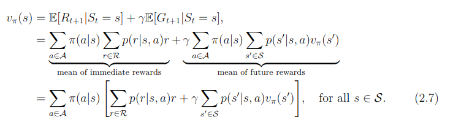
其中，
* $s'$ 可以看成未来的所有状态，
* $p(s'|s)$  是指从当前状态转移到未来状态的概率。
* $V(s')$ 代表的是未来某一个状态的价值。我们从当前状态开始，有一定的概率去到未来的所有状态，所以我们要把 $p\left(s^{\prime} \mid s\right)$ 写上去。我们得到了未来状态后，乘一个 $\gamma$，这样就可以把未来的奖励打折扣。
* $\gamma \sum_{s^{\prime} \in S} p\left(s^{\prime} \mid s\right) V\left(s^{\prime}\right)$ 可以看成未来奖励的折扣总和（discounted sum of future reward）。

贝尔曼方程定义了当前状态与未来状态之间的关系。**未来奖励的折扣总和加上即时奖励，就组成了贝尔曼方程**。
贝尔曼方程的推导过程如下：

$$
  \begin{aligned}
    V(s)&=\mathbb{E}\left[G_{t} \mid s_{t}=s\right]\\
    &=\mathbb{E}\left[r_{t+1}+\gamma r_{t+2}+\gamma^{2} r_{t+3}+\ldots \mid s_{t}=s\right]  \\
    &=\mathbb{E}\left[r_{t+1}|s_t=s\right] +\gamma \mathbb{E}\left[r_{t+2}+\gamma r_{t+3}+\gamma^{2} r_{t+4}+\ldots \mid s_{t}=s\right]\\
    &=R(s)+\gamma \mathbb{E}[G_{t+1}|s_t=s] \\
    &=R(s)+\gamma \mathbb{E}[V(s_{t+1})|s_t=s]\\
    &=R(s)+\gamma \sum_{s^{\prime} \in S} p\left(s^{\prime} \mid s\right) V\left(s^{\prime}\right)
    \end{aligned}  
$$

当我们把贝尔曼方程写成矩阵形式(matrix vector form)后，可以直接求解：
$$
  \begin{aligned}
    \boldsymbol{V} &= \boldsymbol{\boldsymbol{R}}+ \gamma \boldsymbol{P}\boldsymbol{V} \\
    \boldsymbol{I}\boldsymbol{V} &= \boldsymbol{R}+ \gamma \boldsymbol{P}\boldsymbol{V} \\
    (\boldsymbol{I}-\gamma \boldsymbol{P})\boldsymbol{V}&=\boldsymbol{R} \\
    \boldsymbol{V}&=(\boldsymbol{I}-\gamma \boldsymbol{P})^{-1}\boldsymbol{R}
    \end{aligned}
$$

我们可以直接得到**解析解（analytic solution）**：
$$
  \boldsymbol{V}=(\boldsymbol{I}-\gamma \boldsymbol{P})^{-1} \boldsymbol{R}
$$
我们可以通过矩阵求逆把 $\boldsymbol{V}$ 的价值直接求出来。但是一个问题是这个矩阵求逆的过程的复杂度是 $O(N^3)$。所以当状态非常多的时候，比如从10个状态到1000个状态，或者到100万个状态，当我们有100万个状态的时候，状态转移矩阵就会是一个100万乘100万的矩阵，对这样一个大矩阵求逆是非常困难的。所以这种通过解析解去求解的方法只适用于很小量的马尔可夫奖励过程。
另一种方法是**迭代求解**
$$
\boldsymbol{V_{k+1}} = \boldsymbol{\boldsymbol{R_{\pi}}}+ \gamma \boldsymbol{P_{\pi}}\boldsymbol{V_k} 
$$
#### 状态价值函数与动作价值函数（Q函数）
马尔可夫决策过程中的状态价值函数可定义为
$$
V_{\pi}(s)=\mathbb{E}_{\pi}\left[G_{t} \mid s_{t}=s\right] \tag{2.3}
$$
可以理解为**在某个状态下回报的期望(mean均值)**

这里我们另外引入了一个 **Q 函数（Q-function）**。Q 函数也被称为**动作价值函数（action-value function）**。Q 函数定义的是**在某一个状态采取某一个动作，它有可能得到的回报的一个期望(mean均值)**，即
$$
Q_{\pi}(s, a)=\mathbb{E}_{\pi}\left[G_{t} \mid s_{t}=s, a_{t}=a\right] \tag{2.4}
$$
这里的期望其实也是基于策略函数的。所以我们需要对策略函数进行一个加和，然后得到它的价值。
对 Q 函数中的动作进行加和，就可以得到状态价值函数：
$$
V_{\pi}(s)=\sum_{a \in A} \pi(a \mid s) Q_{\pi}(s, a)
\tag{2.5}
$$

#### 贝尔曼期望方程

我们可以把状态价值函数和 Q 函数拆解成两个部分：即时奖励和后续状态的折扣价值（discounted value of successor state）。
通过对状态价值函数进行分解，我们就可以得到一个类似于之前马尔可夫奖励过程的贝尔曼方程————**贝尔曼期望方程（Bellman expectation equation）**：
$$
  V_{\pi}(s)=\mathbb{E}_{\pi}\left[r_{t+1}+\gamma V_{\pi}\left(s_{t+1}\right) \mid s_{t}=s\right] \tag{2.6} 
$$

对于 Q 函数，我们也可以做类似的分解，得到 Q 函数的贝尔曼期望方程：
$$
  Q_{\pi}(s, a)=\mathbb{E}_{\pi}\left[r_{t+1}+\gamma Q_{\pi}\left(s_{t+1}, a_{t+1}\right) \mid s_{t}=s, a_{t}=a\right] \tag{2.7}
$$
贝尔曼期望方程定义了当前状态与未来状态之间的关联。

#### 贝尔曼最优方程

当我们一直采取 arg max 操作的时候，我们会得到一个单调的递增。通过采取这种贪心操作（arg max 操作），我们就会得到更好的或者不变的策略，而不会使价值函数变差。我们取让 Q 函数值最大化的动作，Q 函数就会直接变成价值函数，即
$$
  Q_{\pi}\left(s, \pi^{\prime}(s)\right)=\max _{a \in A} Q_{\pi}(s, a)=Q_{\pi}(s, \pi(s))=V_{\pi}(s)
$$

我们也就可以得到**贝尔曼最优方程（Bellman optimality equation）**
$$
  V_{\pi}(s)=\max _{a \in A} Q_{\pi}(s, a)
$$
贝尔曼最优方程表明：最佳策略下的**一个状态的价值必须等于在这个状态下采取最好动作得到的回报的期望**。 当马尔可夫决策过程满足贝尔曼最优方程的时候，整个马尔可夫决策过程已经达到最佳的状态。
#### 策略迭代 

策略迭代由两个步骤组成：**策略评估（policy evaluate）和策略改进（policy improvement）**。如图 2.21a 所示，**第一个步骤是策略评估**，当前我们在优化策略 $\pi$，当取得最佳价值函数后，我们可以通过对 Q 函数进行最大化来得到最佳策略(greedy 算法)：
$$
  \pi^{*}(a \mid s)=\left\{\begin{array}{ll}
  1, &  a=\underset{a \in A}{\arg \max} Q^{*}(s, a) \\
  0, & \text {其他 }
  \end{array}\right.
$$
我们先保证这个策略不变，然后估计它的价值，即给定当前的最优策略函数$V^{t}_{\pi_{i}}\left(s^{\prime}\right)$来估计下一时刻状态价值函数$V^{t+1}_{\pi_{i}}(s)$。
$$
  V^{t+1}_{\pi_{i}}(s)=\sum_{a \in A} \pi(a \mid s)\left(R(s, a)+\gamma \sum_{s^{\prime} \in S} p\left(s^{\prime} \mid s, a\right) V^{t}_{\pi_{i}}\left(s^{\prime}\right)\right) \tag{2.18} 
$$
这里再来看一下**第二个步骤————策略改进**，看我们是如何改进策略的。得到状态价值函数后，我们就可以通过奖励函数以及状态转移函数来计算 Q 函数：
$$
  Q_{\pi_{i}}(s, a)=R(s, a)+\gamma \sum_{s^{\prime} \in S} p\left(s^{\prime} \mid s, a\right) V_{\pi_{i}}\left(s^{\prime}\right)
$$

对于每个状态，策略$\pi_{i}$改进会得到它的新一轮的策略$\pi_{i+1}$，对于每个状态，我们取使它得到最大值的动作，即
$$
  \pi_{i+1}(s)=\underset{a}{\arg \max } ~Q_{\pi_{i}}(s, a)
$$

如图 2.22 所示，我们可以把 Q 函数看成一个 **Q表格（Q-table）**：横轴是它的所有状态，纵轴是它的可能的动作。如果我们得到了 Q 函数，Q表格也就得到了。对于某个状态，每一列里面我们会取最大的值，最大值对应的动作就是它现在应该采取的动作。所以 arg max 操作是指在每个状态里面采取一个动作，这个动作是能使这一列的 Q 函数值最大化的动作。


 <div align=center>

</div>
 <div align=center>图 2.22 Q表格</div>

所以如图 2.23b 所示，在策略迭代里面，在初始化的时候，我们有一个初始化的状态价值函数 $V$ 和 策略$\pi$ ，然后在这两个步骤之间迭代。图 2.23b 上面的线就是我们当前状态价值函数的值，下面的线是策略的值。策略迭代的过程与踢皮球一样。我们先给定当前已有的策略函数，计算它的状态价值函数。算出状态价值函数后，我们会得到一个 Q 函数。我们对Q 函数采取贪心的策略，这样就像踢皮球，“踢”回策略。然后进一步改进策略，得到一个改进的策略后，它还不是最佳的策略，我们再进行策略评估，又会得到一个新的价值函数。基于这个新的价值函数再进行 Q 函数的最大化，这样逐渐迭代，状态价值函数和策略就会收敛。


<div align=center>

</div>
 <div align=center>图 2.23 策略迭代</div>


#### 价值迭代 

第一步策略更新(policy update)
$$
  \pi_{i+1}(s)=\underset{a}{\arg \max }\sum_{a \in A} \pi(a \mid s)\underbrace{\left(R(s, a)+\gamma \sum_{s^{\prime} \in S} p\left(s^{\prime} \mid s, a\right) V_i\left(s^{\prime}\right)\right)}_{{Q_i(s,a)}}
$$
最优的策略解决方法（greedy 算法）
$$
  \pi_{i+1}(a \mid s)=\left\{\begin{array}{ll}
  1, &  a=\underset{a \in A}{\arg \max} Q_{k}(s, a) \\
  0, & \text {其他 }
  \end{array}\right.
$$
第二步值更新（value update）
$$
  V_{i+1}(s)=\sum_{a \in A} \pi_{i+1}(a \mid s)\underbrace{\left(R(s, a)+\gamma \sum_{s^{\prime} \in S} p\left(s^{\prime} \mid s, a\right) V_i\left(s^{\prime}\right)\right)}_{{Q_i(s,a)}}
$$
#### 马尔可夫决策过程中的预测和控制总结
总结如表 2.1 所示，我们使用动态规划算法来解马尔可夫决策过程里面的预测和控制，并且采取不同的贝尔曼方程。对于预测问题，即策略评估的问题，我们不停地执行贝尔曼期望方程，这样就可以估计出给定的策略，然后得到价值函数。对于控制问题，如果我们采取的算法是策略迭代，使用的就是贝尔曼期望方程；如果我们采取的算法是价值迭代，使用的就是贝尔曼最优方程。


策略迭代与价值迭代过程如下：
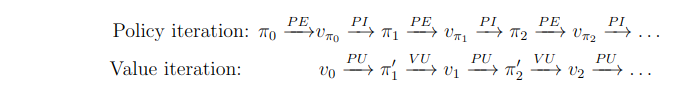

#### 有模型(with model)与免模型(without model)的区别 
当马尔可夫决策过程的模型未知或者模型很大时，我们可以使用免模型强化学习的方法。免模型强化学习方法没有获取环境的状态转移和奖励函数，而是让智能体与环境进行交互，**采集大量的轨迹数据**，智能体从轨迹中获取信息来改进策略，从而获得更多的奖励。

#### Q表格
在多次尝试和熊打交道之后，我们就可以对熊的不同的状态做出判断，用状态动作价值来表达在某个状态下某个动作的好坏。后续能够获得多少总奖励。如果可以预估未来的总奖励的大小，我们就知道在当前的状态下选择哪个动作价值更高。
如图 3.6 所示，如果 **Q 表格**是一张已经训练好的表格，这张表格就像是一本生活手册。通过查看这本手册，我们就知道在熊发怒的时候，装死的价值会高一点；在熊离开的时候，我们偷偷逃跑会比较容易获救。


#### 免模型预测方法(表格tabular形式)
在无法获取马尔可夫决策过程的模型情况下，我们可以通过**蒙特卡洛方法和时序差分方法**来估计某个给定策略的价值。
##### 蒙特卡洛策略评估(no incremental->incremental形式)
**蒙特卡洛**方法是基于采样的方法，给定策略 $\pi$，我们让智能体与环境进行交互，可以得到很多轨迹。每个轨迹都有对应的回报：

$$
G_{t}=r_{t+1}+\gamma r_{t+2}+\gamma^{2} r_{t+3}+\ldots
$$

我们求出所有轨迹的回报的平均值，就可以知道某一个策略对应状态的价值，即 
$$
V_{\pi}(s)=\mathbb{E}_{\tau \sim \pi}\left[G_{t} \mid  s_{t}=s\right]
$$

蒙特卡洛仿真是指我们可以采样大量的轨迹，计算所有轨迹的真实回报，然后计算平均值。**蒙特卡洛方法使用经验平均回报（empirical mean return）的方法来估计**，它不需要马尔可夫决策过程的状态转移函数和奖励函数，并且不需要像动态规划那样用自举的方法。此外，蒙特卡洛方法有一定的局限性，它只能用在有终止的马尔可夫决策过程中。
假设现在有样本 $x_1,x_2,\cdots, x_t$，我们可以把**经验均值（no incremental）转换成增量均值（incremental）的形式**：
$$
\begin{aligned}
	\mu_{t} &=\frac{1}{t} \sum_{j=1}^{t} x_{j} \\
	&=\frac{1}{t}\left(x_{t}+\sum_{j=1}^{t-1} x_{j}\right) \\
	&=\frac{1}{t}\left(x_{t}+(t-1) \mu_{t-1}\right) \\
	&=\frac{1}{t}\left(x_{t}+t \mu_{t-1}-\mu_{t-1}\right) \\
	&=\mu_{t-1}+\frac{1}{t}\left(x_{t}-\mu_{t-1}\right) 
	\end{aligned}
$$
通过这种转换，我们就可以把上一时刻的平均值与现在时刻的平均值建立联系，即
$$
	\mu_t = \mu_{t-1}+\frac{1}{t}(x_t-\mu_{t-1})
$$
其中，$x_t- \mu_{t-1}$ 是残差，$\frac{1}{t}$ 类似于学习率（learning rate）。
当我们得到 $x_t$时，就可以用上一时刻的值来更新现在的值。
###### RM算法
Robbins-Monro (RM)算法，让$g(w) =0$ ,$a_k$是学习率
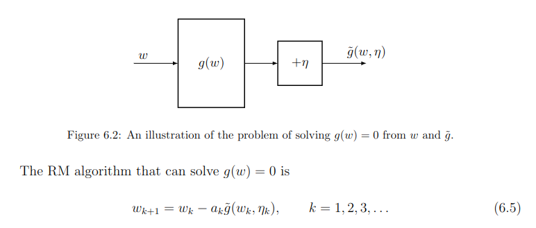
我们可以把蒙特卡洛方法更新的方法写成增量式蒙特卡洛（incremental MC）方法。我们采集数据，得到一个新的轨迹 $(s_1,a_1,r_1,\dots,s_t)$。对于这个轨迹，我们采用增量的方法进行更新：


$$
\begin{array}{l}
N\left(s_{t}\right) \leftarrow N\left(s_{t}\right)+1 \\
V\left(s_{t}\right) = V\left(s_{t}\right)+\frac{1}{N\left(s_{t}\right)}\left(G_{t}-V\left(s_{t}\right)\right)
\end{array}	
$$

我们可以直接把 $\frac{1}{N(s_t)}$ 变成 $\alpha$（学习率），即
$$
	V\left(s_{t}\right) = V\left(s_{t}\right)+\alpha\left(G_{t}-V\left(s_{t}\right)\right)
$$
##### 时序差分方法(基于状态值state values)
**时序差分方法**的目的是对于某个给定的策略 $\pi$，在线（online）地算出它的价值函数 $V_{\pi}$，即一步一步地（step-by-step）算。
最简单的算法是**一步时序差分（one-step TD）**，即TD(0)。每往前走一步，就做一步自举，用得到的估计回报（estimated return）$r_{t+1}+\gamma V(s_{t+1})$ 来更新上一时刻的值 $V(s_t)$：
$$
  V_{t+1}\left(s_{t}\right) = V_t\left(s_{t}\right)+\alpha_t\left(r_{t+1}+\gamma V_t\left(s_{t+1}\right)-V\left(s_{t}\right)\right) \tag{3.1}  \\
  V_{t+1} = V_{t}  \text{   for all } s \neq s_t
$$
估计回报 $G_t=r_{t+1}+\gamma V(s_{t+1})$ 被称为**时序差分目标（TD target）**，

**时序差分误差（TD error）** $\delta=r_{t+1}+\gamma V(s_{t+1})-V(s_t)$。
类比增量式蒙特卡洛方法，给定一个回合 $i$，我们可以更新 $V(s_t)$ 来逼近真实的回报 $G_t$，具体更新公式为
$$
V\left(s_{t}\right) = V\left(s_{t}\right)+\alpha\left(G_{i, t}-V\left(s_{t}\right)\right)
$$
另一种表达方法
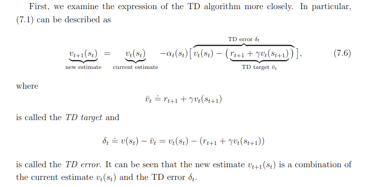
###### n步时序差分

这样我们就可以通过步数来调整算法需要的实际奖励和自举。

$$
\begin{array}{lcl}
n=1\text{（TD）} &G_{t}^{(1)}&=r_{t+1}+\gamma V\left(s_{t+1}\right) \\
n=2 &G_{t}^{(2)}&= r_{t+1}+\gamma r_{t+2}+\gamma^{2} V\left(s_{t+2}\right) \\
& &\vdots \\
n=\infty\text{（MC）} &G_{t}^{\infty}&=r_{t+1}+\gamma r_{t+2}+\ldots+\gamma^{T-t-1} r_{T}
\end{array} \tag{3.2}
$$

如式(3.2)所示，通过调整步数，可以进行蒙特卡洛方法和时序差分方法之间的权衡。如果 $n=\infty$， 即整个游戏结束后，再进行更新，时序差分方法就变成了蒙特卡洛方法。

$n$步时序差分可写为

$$
G_{t}^{n}=r_{t+1}+\gamma r_{t+2}+\ldots+\gamma^{n-1} r_{t+n}+\gamma^{n} V\left(s_{t+n}\right)
$$

#### 免模型控制(表格tabular形式)  

##### 基本蒙特卡洛算法

策略迭代由两个步骤组成。第一、策略评估；
$$
q_{\pi}(s,a) = E(G_t | s_t = s,a_t =a) \approx \frac{1}{n} \sum_{i =0}^n(g^i_{\pi_k}(s,a)) 
$$
第二，策略改进，即
$$
  \pi_{k+1}(a \mid s)=\left\{\begin{array}{ll}
  1, &  a=a^*_k \\
  0, &  a \neq a^*_k
  \end{array}\right.
$$

这两个步骤是一个互相迭代的过程。

$$
  \pi_{i+1}(s)=\underset{\pi}{\arg \max }\sum_{a \in A} \pi(a \mid s)\underbrace{\left(\sum_{r}p(r|s,a)r+\gamma \sum_{s^{\prime} \in S} p\left(s^{\prime} \mid s, a\right) V_i\left(s^{\prime}\right)\right)}_{{q_{\pi}(s,a)}}
$$

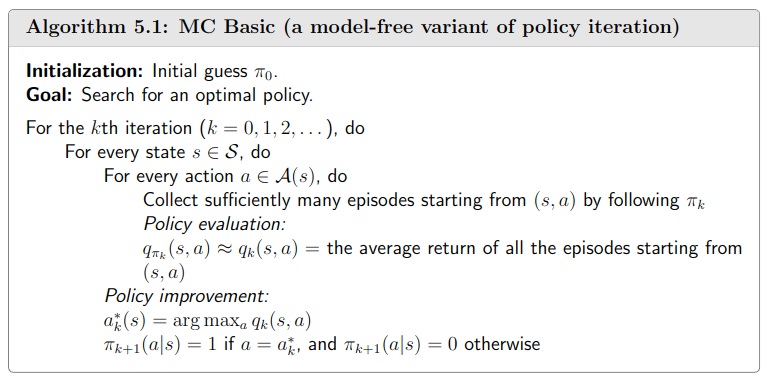

##### 蒙特卡洛算法探索性开始
假设每一个回合都有一个探索性开始，探索性开始保证所有的状态和动作都在无限步的执行后能被采样到，这样才能很好地进行估计。
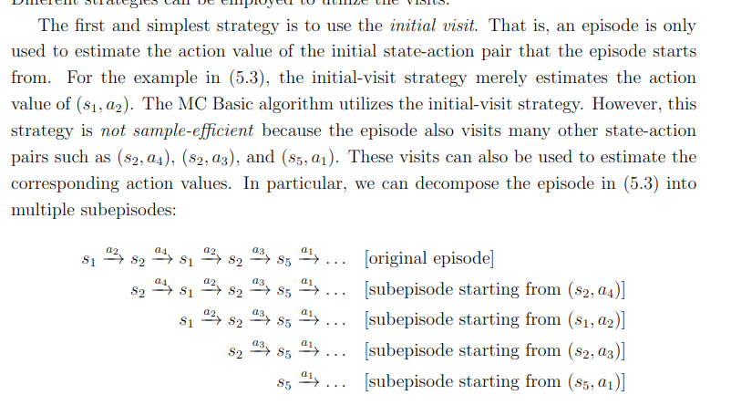
数据将被充分利用，具体过程如下：
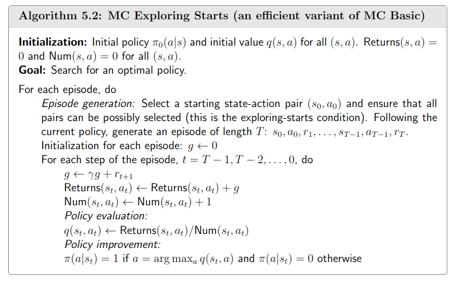

##### 蒙特卡洛算法和特别贪心算法
当我们使用蒙特卡洛方法和 $\varepsilon$-贪心探索的时候，可以确保价值函数是单调的、改进的。对于任何 $\varepsilon$-贪心策略 $\pi$，关于 $Q_{\pi}$ 的 $\varepsilon$-贪心策略 $\pi^{\prime}$ 都是一个改进，即 $V_{\pi}(s) \leqslant V_{\pi^{\prime}}(s)$，证明过程如下：

$$
\begin{aligned}
	Q_{\pi}\left(s, \pi^{\prime}(s)\right) &=\sum_{a \in A} \pi^{\prime}(a \mid s) Q_{\pi}(s, a) \\
	&=\frac{\varepsilon}{|A|} \sum_{a \in A} Q_{\pi}(s, a)+(1-\varepsilon) \max _{a} Q_{\pi}(s, a) \\
	& \geqslant \frac{\varepsilon}{|A|} \sum_{a \in A} Q_{\pi}(s, a)+(1-\varepsilon) \sum_{a \in A} \frac{\pi(a \mid s)-\frac{\varepsilon}{|A|}}{1-\varepsilon} Q_{\pi}(s, a) \\
	&=\sum_{a \in A} \pi(a \mid s) Q_{\pi}(s, a)=V_{\pi}(s)
	\end{aligned}
$$

基于 $\varepsilon$-贪心探索的蒙特卡洛方法如下：
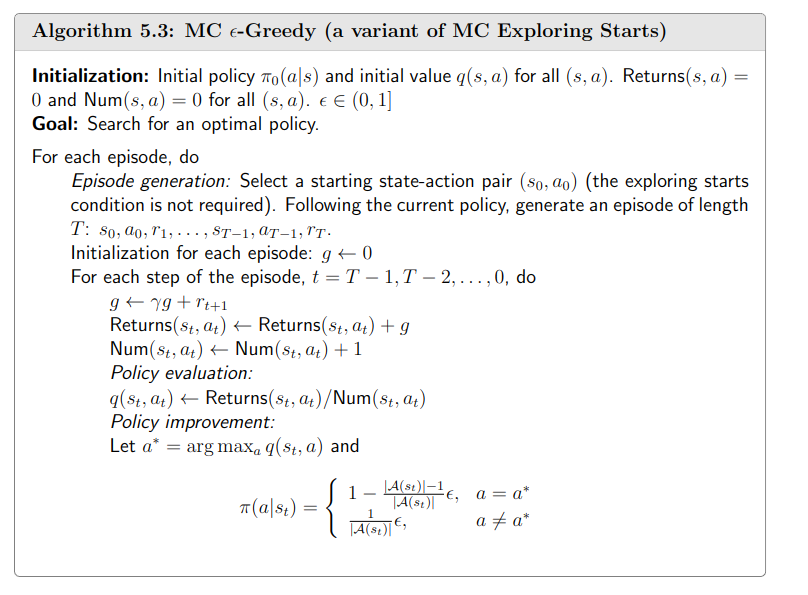

与蒙特卡洛方法相比，时序差分方法有如下几个优势：低方差，能够在线学习，能够从不完整的序列中学习。
所以我们可以把时序差分方法也放到控制循环（control loop）里面去估计Q表格，再采取 $\varepsilon$-贪心探索改进。这样就可以在回合没结束的时候更新已经采集到的状态价值。  

>偏差（bias）：描述的是预测值（估计值）的期望与真实值之间的差距。偏差越高，越偏离真实数据，如图 3.27 第2行所示。
方差（variance）：描述的是预测值的变化范围、离散程度，也就是离其期望值的距离。方差越高，数据的分布越分散，如图 3.27 右列所示。


<div align=center>

</div>
<div align=center>图 3.27 偏差-方差</div>


##### Sarsa：同策略时序差分控制（基于动作值函数 action values）
Sarsa 所做出的改变很简单，它将原本时序差分方法更新 $V$ 的过程，变成了更新 $Q$，即
$$
  Q\left(s_{t}, a_{t}\right) \leftarrow Q\left(s_{t}, a_{t}\right)+\alpha\left[r_{t+1}+\gamma Q\left(s_{t+1}, a_{t+1}\right)-Q\left(s_{t}, a_{t}\right)\right] \tag{3.4}
$$

式(3.4)是指我们可以用下一步的 Q 值 $Q(s_{t+_1},a_{t+1})$ 来更新这一步的 Q 值 $Q(s_t,a_t)$ 。
Sarsa 直接估计 Q 表格，得到 Q 表格后，就可以更新策略。

为了理解式(3.4)，
如图 3.28 所示，我们先把 $r_{t+1}+\gamma Q\left(s_{t+1}, a_{t+1}\right.)$ 当作目标值，即 $Q(s_t,a_t)$ 想要逼近的目标值。$r_{t+1}+\gamma Q\left(s_{t+1}, a_{t+1}\right.)$ 就是时序差分目标。

<div align=center>

</div>
<div align=center>图 3.28 时序差分单步更新</div>

该算法由于每次更新值函数时需要知道当前的状态（state）、当前的动作（action）、奖励（reward）、下一步的状态（state）、下一步的动作（action），即 $(s_{t}, a_{t}, r_{t+1}, s_{t+1}, a_{t+1})$ 这几个值 ，因此得名 **Sarsa** 算法。它走了一步之后，获取了 $(s_{t}, a_{t}, r_{t+1}, s_{t+1}, a_{t+1})$  之后，就可以做一次更新。

如图 3.29 所示，Sarsa 的更新公式可写为
$$
	Q(S, A) \leftarrow Q(S, A)+\alpha\left(R+\gamma Q\left(S^{\prime}, A^{\prime}\right)-Q(S, A)\right)
$$

Sarsa的更新公式与时序差分方法的公式是类似的。$S'$ 就是 $s_{t+1}$ 。我们就是用下一步的 Q 值 $Q(S',A')$ 来更新这一步的 Q 值 $Q(S,A)$，不断地强化每一个 Q 值。
$$
\begin{array}{lrl}
	{n=1}\text {（Sarsa）} &Q_{t}^{1}&=r_{t+1}+\gamma Q\left(s_{t+1}, a_{t+1}\right) \\
	n=2 &Q_{t}^{2}&=r_{t+1}+\gamma r_{t+2}+\gamma^{2} Q\left(s_{t+2}, a_{t+2}\right) \\
	&&\vdots \\
	n=\infty\text{（MC）} \quad &Q_{t}^{\infty}&=r_{t+1}+\gamma r_{t+2}+\ldots+\gamma^{T-t-1} r_{T}
	\end{array} \tag{3.5}
$$

我们考虑 $n$ 步的回报（$n=1,2,\cdots,\infty$），如式(3.5)所示。Sarsa 属于单步更新算法，每执行一个动作，就会更新一次价值和策略。如果不进行单步更新，而是采取 $n$ 步更新或者回合更新，即在执行 $n$ 步之后再更新价值和策略，这样我们就得到了 **$n$ 步 Sarsa（$n$-step Sarsa）**。
##### Q学习：异策略时序差分控制 

Sarsa 是一种**同策略**（on-policy）算法，它优化的是它实际执行的策略，它直接用下一步会执行的动作去优化 Q 表格。同策略在学习的过程中，只存在一种策略，它用一种策略去做动作的选取，也用一种策略去做优化。所以 Sarsa 知道它下一步的动作有可能会跑到悬崖那边去，它就会在优化自己的策略的时候，尽可能离悬崖远一点。这样子就会保证，它下一步哪怕是有随机动作，它也还是在安全区域内。

Q学习是一种**异策略**（off-policy）算法。如图 3.31 所示，异策略在学习的过程中，有两种不同的策略：**目标策略（target policy）**和**行为策略（behavior policy）**。
**目标策略**是我们需要去学习的策略，一般用 $\pi_T$ 来表示。目标策略就像是在后方指挥战术的一个军师，它可以根据自己的经验来学习最优的策略，不需要去和环境交互。
**行为策略**是探索环境的策略，一般用 $\pi_b$ 来表示。行为策略可以大胆地去探索到所有可能的轨迹，采集轨迹，采集数据，然后把采集到的数据“喂”给目标策略学习。而且“喂”给目标策略的数据中并不需要 $a_{t+1}$ ，而 Sarsa 是要有 $a_{t+1}$ 的。行为策略像是一个战士，可以在环境里面探索所有的动作、轨迹和经验，然后把这些经验交给目标策略去学习。比如目标策略优化的时候，Q学习不会管我们下一步去往哪里探索，它只选取奖励最大的策略。


Q学习有两种策略：行为策略和目标策略。
目标策略 $\pi_T$ 直接在 Q表格上使用geedy贪心策略，取它下一步能得到的所有状态，即
$$
	\pi\left(s_{t+1}\right)=\underset{a^{\prime}}{\arg \max}~ Q\left(s_{t+1}, a^{\prime}\right)
$$
行为策略 $\pi_b$ 可以是一个随机的策略，但我们采取 $\varepsilon$-贪心策略，让行为策略不至于是完全随机的，它是基于Q表格逐渐改进的。
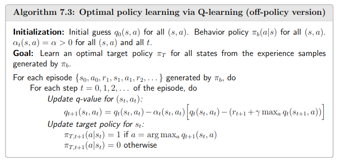
我们可以构造 Q学习 目标，Q学习的下一个动作都是通过 arg max 操作选出来的，于是我们可得
$$
\begin{aligned}
r_{t+1}+\gamma Q\left(s_{t+1}, A^{\prime}\right) &=r_{t+1}+\gamma Q\left(s_{t+1},\arg \max ~Q\left(s_{t+1}, a^{\prime}\right)\right) \\
&=r_{t+1}+\gamma \max _{a^{\prime}} Q\left(s_{t+1}, a^{\prime}\right)
\end{aligned}	
$$

##### 同策略与异策略的区别 

总结一下同策略和异策略的区别。
* Sarsa 是一个典型的同策略算法，它只用了一个策略 $\pi$，它不仅使用策略 $\pi$ 学习，还使用策略 $\pi$ 与环境交互产生经验。
如果策略采用 $\varepsilon$-贪心算法，它需要兼顾探索，为了兼顾探索和利用，它训练的时候会显得有点“胆小”。它在解决悬崖行走问题的时候，会尽可能地远离悬崖边，确保哪怕自己不小心探索了一点儿，也还是在安全区域内。此外，因为采用的是 $\varepsilon$-贪心 算法，策略会不断改变（$\varepsilon$ 值会不断变小），所以策略不稳定。
* Q学习是一个典型的异策略算法，它有两种策略————目标策略和行为策略，它分离了目标策略与行为策略。Q学习可以大胆地用行为策略探索得到的经验轨迹来优化目标策略，从而更有可能探索到最佳策略。行为策略可以采用 $\varepsilon$-贪心 算法，但目标策略采用的是贪心算法，它直接根据行为策略采集到的数据来采用最佳策略，所以 Q学习 不需要兼顾探索。

* 我们比较一下 Q学习 和 Sarsa 的更新公式，就可以发现 Sarsa 并没有选取最大值的最大化操作。因此，Q学习是一个非常激进的方法，它希望每一步都获得最大的利益；Sarsa 则相对较为保守，它会选择一条相对安全的迭代路线。

TD算法可以用通用表达方式：
$$
q_{t+1}(s,a) = q_t(s,a) + \alpha_t(s,a)(q_t(s,a)  - \bar{q}_t)
$$
其中$\bar{q}_t$有不同种表达方式，就有不同算法类型，且不同算法可以求解**贝尔曼方程BE和贝尔曼最优方程BOE**。
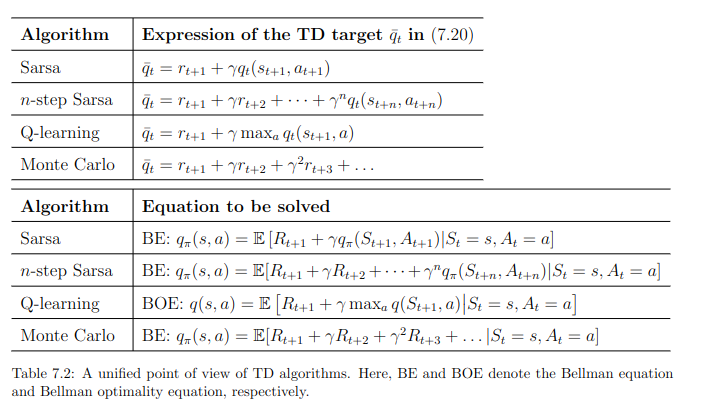

#### deep Q learning(函数function->网络network)  
传统的强化学习算法会使用表格的形式存储状态价值函数 $V(s)$ 或动作价值函数 $Q(s,a)$，但是这样的方法存在很大的局限性。例如，现实中的强化学习任务所面临的状态空间往往是连续的，存在无穷多个状态（**泛化能力**），在这种情况下，就不能再使用表格对价值函数进行存储。价值函数近似利用函数直接拟合状态价值函数或动作价值函数，降低了对存储空间的要求（**存储能力**），有效地解决了这个两个问题。

为了在连续的状态和动作空间中计算值函数 $Q_{\pi}(s,a)$，我们可以用一个函数 $Q_{\phi}(\boldsymbol{s},\boldsymbol{a})$ 来表示近似计算，称为**价值函数近似（value function approximation）**。
$$
    Q_{\phi}(\boldsymbol{s}, \boldsymbol{a}) \approx Q_{\pi}(\boldsymbol{s}, \boldsymbol{a})
$$
其中，$\boldsymbol{s}$、$\boldsymbol{a}$ 分别是状态 $s$ 和动作 $a$ 的向量表示，函数 $Q_{\phi}(\boldsymbol{s}, \boldsymbol{a})$ 通常是一个参数为 $\phi$ 的函数，比如神经网络，其输出为一个实数，称为 **Q 网络（Q-network）**。

##### 状态价值函数 

深度Q网络 是基于状态价值的算法，在基于状态价值的算法里面，我们学习的不是策略，而是**评论员（critic）**。评论员的任务是评价现在的动作有多好或有多不好，怎么衡量状态价值函数 $V_{\pi}(s)$ 呢？有两种不同的方法：基于蒙特卡洛的方法和基于时序差分的方法。基于蒙特卡洛的方法就是让演员与环境交互，我们要看演员好不好，就让演员与环境交互，让评论员评价。
###### 蒙特卡洛的方法
如图 6.2 所示，如果在状态 $s_a$，接下来的累积奖励就是 $G_a$。也就是对这个价值函数，如果输入是状态 $s_a$，正确的输出应该是 $G_a$；如果输入状态是 $s_b$，正确的输出应该是 $G_b$。所以在训练的时候， 它就是一个回归问题（regression problem）。网络的输出就是一个值，我们希望在输入 $s_a$ 的时候，输出的值$G_{\pi}(s_a)$与 $G_a$ 越接近越好；输入 $s_b$ 的时候，输出的值$G_{\pi}(s_b)$与 $G_b$ 越接近越好。接下来继续训练网络，这是基于蒙特卡洛的方法。

<div align=center>

</div>
<div align=center>图 6.2 基于蒙特卡洛的方法</div>

###### 时序差分方法（TD）
第二个方法是**时序差分**的方法，即基于时序差分的方法。在基于蒙特卡洛的方法中，每次我们都要计算累积奖励，也就是从某一个状态 $s_a$ 一直到游戏结束的时候，得到的所有奖励的总和。如果我们要使用基于蒙特卡洛的方法，我们必须至少玩到游戏结束。但有些游戏时间非常长，我们要玩到游戏结束才能够更新网络，这花的时间太多了，因此我们会采用基于时序差分的方法。基于时序差分的方法不需要玩到游戏结束，只需要在游戏的某一个状态 $s_t$ 的时候，采取动作 $a_t$ 得到奖励$r_t$ ，接下来进入状态 $s_{t+1}$，就可以使用时序差分的方法。
我们把 $s_t$ 输入网络，因为把 $s_t$ 输入网络会得到 $V_{\pi}(s_t)$，把 $s_{t+1}$ 输入网络会得到 $V_{\pi}(s_{t+1})$，$V_{\pi}(s_t)$ 减 $V_{\pi}(s_{t+1})$ 的值应该是 $r_t$。我们希望它们相减的损失与 $r_t$ 接近，训练下去，更新 $V_{\pi}$ 的参数，我们就可以把 $V_{\pi}$ 函数学习出来。

    
<div align=center>

</div>
<div align=center>图 6.3 基于时序差分的方法</div>

##### 动作价值函数 

还有另外一种评论员称为**Q函数**，它又被称为动作价值函数。状态价值函数的输入是一个状态，它根据状态计算出这个状态以后的期望的累积奖励（expected accumulated reward）是多少。动作价值函数的输入是一个状态-动作对，其指在某一个状态采取某一个动作，假设我们都使用策略 $\pi$ ，得到的累积奖励的期望值有多大。

Q函数有两种写法：

（1）如图 6.6a 所示，输入是状态与动作，输出就是一个标量。这种Q函数既适用于连续动作（动作是无法穷举的），又适用于离散动作。

（2）如图 6.6b 所示，输入是一个状态，输出就是多个值。这种Q函数只适用于离散动作。假设动作是离散的，比如动作就只有 3 个可能：往左、往右或是开火。Q函数输出的 3 个值就分别代表 $a$ 是往左的时候的 Q 值，$a$ 是往右的时候的 Q 值，还有 $a$ 是开火的时候的 Q 值。


    
<div align=center>

</div>
<div align=center>图 6.6 Q函数</div>

###### 算法描述
deep Q学习的最小化目标函数如下(优化方法选择：最小化目标函数选择梯度下降，最大化目标函数选择梯度上升)：
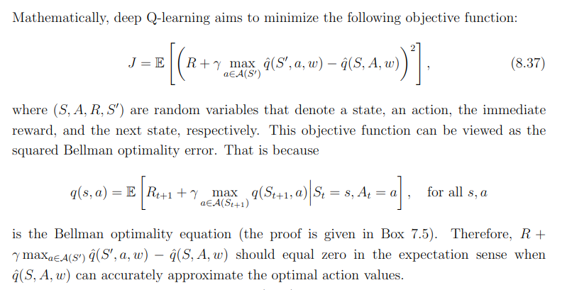

##### 目标网络
$Q_{\pi}\left(s_{t}, a_{t}\right) $ 是**主干网络**的输出，$r_{t}+Q_{\pi}\left(s_{t+1}, \pi\left(s_{t+1}\right)\right)$ 是**目标网络**输出，目标是会变动的。当然如果我们要实现这样的训练，其实也没有问题，就是在做反向传播的时候， $Q_{\pi}$ 的参数会被更新，我们会把两个更新的结果加在一起（因为它们是同一个模型 $Q_{\pi}$， 所以两个更新的结果会加在一起）。但这样会导致训练变得不太稳定，因为假设我们把 $Q_{\pi}\left(s_{t}, a_{t}\right) $ 当作模型的输出， 把$y_T=r_{t}+Q_{\pi}\left(s_{t+1}, \pi\left(s_{t+1}\right)\right)$ 当作目标，我们要去拟合的目标是一直在变动的，这是不太好训练的。下图中$w$是主干网络参数，$w_T$是目标网络参数
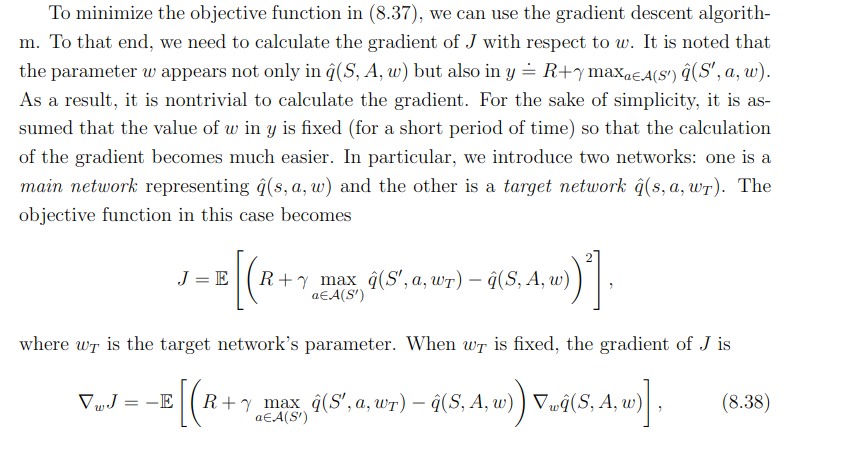
在训练的时候，我们只更新左边的 Q 网络的参数，而右边的 Q 网络的参数会被固定。因为右边的 Q 网络负责产生目标，所以被称为目标网络。因为目标网络是固定的，所以现在得到的目标 $r_{t}+Q_{\pi}\left(s_{t+1}, \pi\left(s_{t+1}\right)\right)$ 的值也是固定的。我们只调整左边Q网络的参数，它就变成一个回归问题。我们希望模型输出的值与目标越接近越好，这样会最小化它的均方误差（mean square error）。
<div align=center>

</div>
<div align=center>图 6.9 目标网络</div>

实现的伪代码如下：
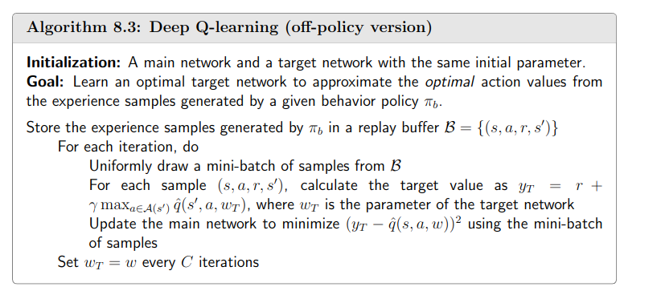

##### 经验回放（experience replay）
经验回放会构建一个**回放缓冲区（replay buffer）**，回放缓冲区又被称为**回放内存（replay memory）**。回放缓冲区是指现在有某一个策略$\pi$ 与环境交互，它会去收集数据$s_t,a_t,r_t,s_{t+1}$，我们把所有的数据放到一个数据缓冲区（buffer）里面。这个随机数据服从**均匀分布**（因为没有先验，不能是高斯分布）
<div align=center>

</div>
<div align=center>图 6.12 经验回放</div>

在每次迭代里面，从回放缓冲区中随机挑一个批量（batch）出来，即与一般的网络训练一样，从训练集里面挑一个批量出来。我们采样该批量出来，里面有一些经验，我们根据这些经验去更新Q函数。
<div align=center>

</div>
<div align=center>图 6.13 使用回放缓冲区训练Q函数</div>

#### 策略梯度算法

##### 定义优化的策略
在我们采样到的数据里面，采样到在某一个状态 $s_t$ 要执行某一个动作 $a_t$，$(s_t,a_t)$ 是在整个轨迹 $\tau$ 的里面的某一个状态和动作的对。假设我们在 $s_t$ 执行 $a_t$，最后发现 $\tau$ 的奖励是正的，我们就要增加在 $s_t$ 执行 $a_t$ 的概率。反之，如果在 $s_t$ 执行 $a_t$ 会导致 $\tau$ 的奖励变成负的， 我们就要减少在 $s_t$ 执行 $a_t$ 的概率。这怎么实现呢？我们用梯度上升来更新参数，原来有一个参数 $\theta$ ，把 $\theta$  加上**梯度**$\nabla \bar{R}_{\theta}$，当然我们要有一个学习率 $\eta$，学习率也是要调整的，可用 Adam、RMSProp 等方法来调整学习率，即
$$
    \theta \leftarrow \theta+\eta \nabla \bar{R}_{\theta}
$$


在传统的策略梯度算法中，我们根据目标函数梯度$\nabla \bar{R}_{\theta}$ 和步长$\eta$ 更新策略权重 ，这样的更新过程可能会出现两个常见的问题：

过冲（Overshooting）：更新错过了奖励峰值并落入了次优策略区域
下冲（Undershooting）：在梯度方向上采取过小的更新步长会导致收敛缓慢
如下图overshooting示例：如果在梯度方向上采取的步骤太大（左），更新可能会错过奖励峰值并落在具有低梯度的次优区域（右），需要多次迭代才能逃逸或者甚至无法逃逸
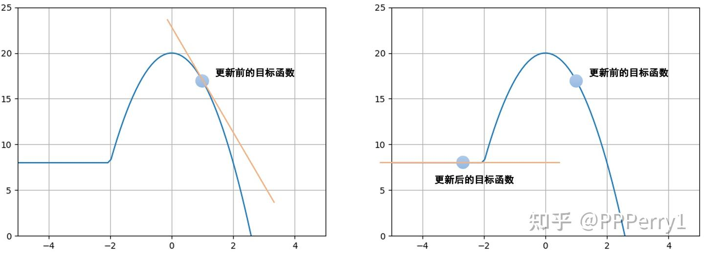

##### 策略梯度
我们可以根据 $\theta$ 算出某一个轨迹 $\tau$ 出现的概率，接下来计算 $\tau$ 的总奖励。总奖励使用 $\tau$ 出现的概率进行加权，对所有的 $\tau$ 进行求和，就是期望值。给定一个参数，我们可以计算期望值为

$$
    \bar{R}_{\theta}=\sum_{\tau} R(\tau) p_{\theta}(\tau)=\mathbb{E}_{\tau \sim p_{\theta}(\tau)}[R(\tau)]
$$
从分布 $p_{\theta}(\tau)$ 采样一个轨迹 $\tau$，计算 $R(\tau)$ 的期望值，就是期望奖励（expected reward）。我们要最大化期望奖励。

因为我们要让奖励越大越好，所以可以使用**梯度上升**（gradient ascent）来最大化期望奖励。要进行梯度上升，我们先要计算期望奖励 $\bar{R}_{\theta}$ 的梯度。我们对 $\bar{R}_{\theta}$ 做梯度运算
$$
    \nabla \bar{R}_{\theta}=\sum_{\tau} R(\tau) \nabla p_{\theta}(\tau)
$$
其中，只有 $p_{\theta}(\tau)$ 与 $\theta$ 有关。
另外一种定义如下
     

##### REINFORCE：蒙特卡洛策略梯度

相比蒙特卡洛方法一个回合更新一次，时序差分方法是每个步骤更新一次，即每走一步，更新一次，时序差分方法的更新频率更高。时序差分方法使用Q函数来近似地表示未来总奖励 $G_t$。

<div align=center>

</div>
<div align=center>图 4.13 蒙特卡洛方法与时序差分方法</div>

最大化策略就是使用梯度上升方法
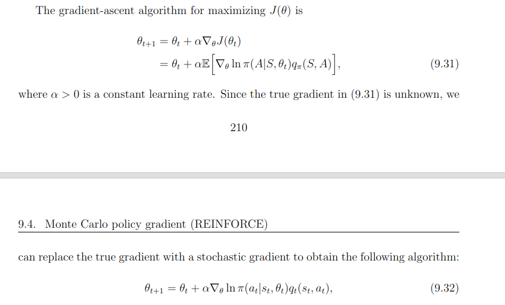
伪代码如下：
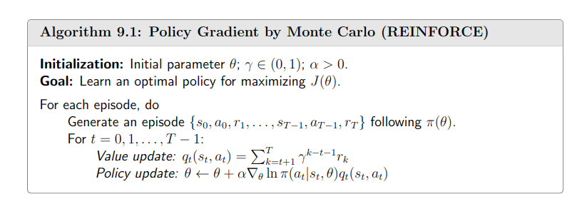
#### 近端策略优化PPO
在讲解**近端策略优化**(proximal policy optimization，PPO)算法前，我们需要明白On/Off policy的概念：

On-policy：用当前的Agent生成经验，并且用于更新这个Agent。即Agent一边和环境互动，一边学习
Off-policy：用其他的Agent生成经验，用于更新当前Agent。即Agent是学习其他的Agent的互动经验
之前所学习的Policy Gradient方法就是On-policy的，它的缺点就是每次更新都需要等Agent环境做互动，更新完之后，前一次互动经验又不能用了。具体原因看下式（5.1）
$$
    \nabla \bar{R}_{\theta}=\mathbb{E}_{\tau \sim p_{\theta}(\tau)}\left[R(\tau) \nabla \log p_{\theta}(\tau)\right] \tag{5.1}
$$
式(5.1)的 $\mathbb{E}_{\tau \sim p_{\theta}(\tau)}$ 是对策略 $\pi_{\theta}$ 采样的轨迹 $\tau$ 求期望。一旦更新了参数，从 $\theta$ 变成 $\theta'$ ，概率 $p_\theta(\tau)$ 就不对了，之前采样的数据也不能用了。这导致了Policy Gradient算法训练很耗时，时间都花在收集数据上。所以我们如果能将Policy Gradient变成Off-policy的算法，那之前互动的数据可以重复使用，大大提升了训练效率。
具体怎么做呢？这就需要介绍**重要性采样（importance sampling）** 的概念。

>对于一个随机变量，我们通常用概率密度函数来刻画该变量的概率分布特性。具体来说，给定随机变量的一个取值，可以根据概率密度函数来计算该值对应的概率（密度）。反过来，也可以根据概率密度函数提供的概率分布信息来生成随机变量的一个取值，这就是采样。因此，从某种意义上来说，采样是概率密度函数的逆向应用。与根据概率密度函数计算样本点对应的概率值不同，采样过程往往没有那么直接，通常需要根据待采样分布的具体特点来选择合适的采样策略。

假设我们有一个函数 $f(x)$，要计算从分布 $p$ 采样 $x$，再把 $x$ 代入 $f$ ，得到 $f(x)$。我们该怎么计算 $f(x)$ 的期望值呢？假设我们不能对分布 $p$ 做积分，但可以从分布 $p$ 采样一些数据 $x^i$。把 $x^i$ 代入 $f(x)$，取它的平均值，就可以近似 $f(x)$ 的期望值。

现在有另外一个问题，假设我们不能从分布 $p$ 采样数据，只能从另外一个分布 $q$ 采样数据$x$，$q$ 可以是任何分布。如果我们从 $q$ 采样 $x^i$，就不能使用式(5.2)。因为式(5.2)是假设 $x$ 都是从 $p$ 采样出来的。
$$
\mathbb{E}_{x \sim p}[f(x)] \approx \frac{1}{N} \sum_{i=1}^N f(x^i) \tag{5.2}
$$

所以我们做一个修正，期望值 $\mathbb{E}_{x \sim p}[f(x)]$ 就是 $\int f(x) p(x) \mathrm{d}x$，我们对其做如下的变换：
$$
    \int f(x) p(x) \mathrm{d}x=\int f(x) \frac{p(x)}{q(x)} q(x) \mathrm{d}x=\mathbb{E}_{x \sim q}[f(x){\frac{p(x)}{q(x)}}]
$$

就可得
$$
\mathbb{E}_{x \sim p}[f(x)]=\mathbb{E}_{x \sim q}\left[f(x) \frac{p(x)}{q(x)}\right] \tag{5.3}
$$
我们就可以写成对 $q$ 里面所采样出来的 $x$ 取期望值。我们从 $q$ 里面采样 $x$，再计算 $f(x) \frac{p(x)}{q(x)}$，再取期望值。所以就算我们不能从 $p$ 里面采样数据，但只要能从 $q$ 里面采样数据，就可以计算从 $p$ 采样 $x$ 代入 $f$ 以后的期望值。

接下来我们改成从 $q(x)$ 采样，因为 $q(x)$ 在右边区域的概率比较高，所以如果我们采样的点不够多，可能只会采样到右侧。如果我们只采样到右侧，可能 $\mathbb{E}_{x \sim q}\left[f(x) \frac{p(x)}{q(x)}\right]$ 是正的。
我们这边采样到这些点，去计算它们的 $f(x) \frac{p(x)}{q(x)}$ 都是正的。我们采样到这些点都是正的，取期望值以后也都是正的，这是因为采样的次数不够多。假设我们采样次数很少，只能采样到右边。左边虽然概率很低，但也有可能被采样到。假设我们好不容易采样到左边的点，因为左边的点的$p(x)$ 和 $q(x)$ 是差很多的， 这边 $p(x)$ 很大，$q(x)$ 很小。 $f(x)$ 好不容易终于采样到一个负的，这个负的就会被乘上一个非常大的权重，这样就可以平衡刚才那边一直采样到正的值的情况。最终我们算出这一项的期望值，终究还是负的。但前提是我们要采样足够多次，这件事情才会发生。但有可能采样次数不够多，$\mathbb{E}_{x \sim p}[f(x)]$ 与 $\mathbb{E}_{x \sim q}\left[f(x) \frac{p(x)}{q(x)}\right]$ 可能就有很大的差距。这就是重要性采样的问题。

怎么改呢？如式(5.4)所示，之前我们用策略 $\pi_{\theta}$ 与环境交互，采样出轨迹 $\tau$，计算 $R(\tau) \nabla \log p_{\theta}(\tau)$。现在我们不用 $\theta$ 与环境交互，假设有另外一个策略 $\pi_{\theta}'$，它就是另外一个演员，它的工作是做示范（demonstration）。

$$
    \nabla \bar{R}_{\theta}=\mathbb{E}_{\tau \sim p_{\theta^{\prime}(\tau)}}\left[\frac{p_{\theta}(\tau)}{p_{\theta^{\prime}}(\tau)} R(\tau) \nabla \log p_{\theta}(\tau)\right] \tag{5.4}
$$

我们可以通过重要性采样把同策略换成异策略，但重要性采样有一个问题：如果 $p_{\theta}\left(a_{t} | s_{t}\right)$ 与 $p_{\theta'}\left(a_{t} | s_{t}\right)$ 相差太多，即这两个分布相差太多，重要性采样的结果就会不好。
怎么避免它们相差太多呢？这就是PPO要做的事情。


PPO 需要优化目标函数 $J^{\theta^{\prime}}(\theta)$。但是这个目标函数又牵涉到重要性采样。在做重要性采样的时候，$p_{\theta}\left(a_{t} | s_{t}\right)$ 不能与 $p_{\theta'}\left(a_{t} | s_{t}\right)$相差太多。做示范的模型不能与真正的模型相差太多，相差太多，重要性采样的结果就会不好。我们在训练的时候，应多加一个约束（constrain）。这个约束是 $\theta$  与 $\theta'$ 输出的动作的 KL 散度（KL divergence），这一项用于衡量 $\theta$ 与 $\theta'$ 的相似程度。我们希望在训练的过程中，学习出的 $\theta$ 与 $\theta'$  越相似越好。因为如果 $\theta$ 与 $\theta'$ 不相似，最后的结果就会不好。所以在 PPO 里面有两项：一项是优化本来要优化的$J^{\theta^{\prime}}(\theta)$，另一项是一个约束。这个约束就好像正则化（regularization）的项（term） 一样，它所做的就是希望最后学习出的 $\theta$ 与 $\theta'$ 相差不大。**注意，虽然 PPO 的优化目标涉及到了重要性采样，但其只用到了上一轮策略 $\theta^{\prime}$ 的数据。PPO 目标函数中加入了 KL 散度的约束，行为策略 $\theta^{\prime}$  和目标策略 $\theta$ 非常接近，PPO 的行为策略和目标策略可认为是同一个策略，因此 PPO 是同策略算法。**

$$
    \begin{aligned}
        &J_{\mathrm{PPO}}^{\theta^{\prime}}(\theta)=J^{\theta^{\prime}}(\theta)-\beta \mathrm{KL}\left(\theta, \theta^{\prime}\right) \\
        &J^{\theta^{\prime}}(\theta)=\mathbb{E}_{\left(s_{t}, a_{t}\right) \sim \pi_{\theta^{\prime}}}\left[\frac{p_{\theta}\left(a_{t} \mid s_{t}\right)}{p_{\theta^{\prime}}\left(a_{t} \mid s_{t}\right)} A^{\theta^{\prime}}\left(s_{t}, a_{t}\right)\right]
        \end{aligned} \tag{5.6}
$$
其中，$A^{\theta}(s_t,a_t)$ 有一个上标 $\theta$，$\theta$  代表 $A^{\theta}(s_t,a_t)$ 是演员 $\theta$ 与环境交互的时候计算出来的。我们用演员$\theta$  采样出 $s_t$ 与 $a_t$，采样出状态-动作的对，我们会计算这个状态-动作对的优势（advantage）$A^{\theta}\left(s_{t}, a_{t}\right)$， 就是它有多好。$A^{\theta}\left(s_{t}, a_{t}\right)$ 即用累积奖励减去基线，这一项就是估测出来的。
### 机器人的真实世界强化学习
端到端的简化控制流水线、数据驱动的特征提取、“无需显式建模而依赖交互数据”——这些都是机器人强化学习的核心特征。然而，强化学习在安全性和学习效率方面仍存在局限性，这对真实世界机器人应用而言尤为关键。    

（1）首先，尤其在训练初期，智能体的动作通常具有探索性，可能表现出随机性。在物理系统上，未训练完成的策略可能会发出“高速度、自碰撞配置或超过关节极限的力矩”等指令，导致设备磨损甚至硬件损坏。要降低这些风险，需引入外部保护机制（如监控器、安全监测器、紧急停止装置），而这往往需要大量人工监督。
（2）此外，在大多数机器人问题采用的“片段式训练”场景中，训练过程中需手动重置环境，这一过程耗时且易出错，大幅降低了实验效率。其次，强化学习的“样本效率低”问题仍未解决——由于训练时间过长，限制了其在真实世界机器人中的适用性。即使是SAC等性能优良的算法，通常也需要大量的状态转移样本；而在真实硬件上生成这些数据非常耗时。     

在模拟器中训练强化学习策略可同时解决上述两个问题：既消除了物理风险，又大幅提高了数据生成效率。
（1）然而，构建和维护“真实世界问题的高保真模拟器”难度极大——尤其对于“接触密集型操作”和“涉及可变形或软材料的任务”。
（2）奖励设计是真实世界强化学习流水线中“脆弱性”的另一个重要来源。尽管为“长时域任务中的探索引导”设计密集奖励通常是必要的，但这一过程易出错且严重依赖人类专业知识和直觉。设计不当的奖励项可能导致“策略投机”（specification gaming）或收敛到局部最优；
通过“从大量人类演示中学习”的行为克隆（BC）技术的进步，可同时解决上述两个问题。尽管行为克隆存在“固有次优性”（模仿学习的性能最多只能与演示者持平），但“通过行为克隆复现专家演示”的方法已被证明具有越来越强的竞争力和实用性——无需依赖仿真环境，也无需设计难以定义的奖励函数。


### 代码示例：真实世界强化学习
从高层架构看，HIL-SERL（图17）依赖两个核心组件：
执行器（Actor）：运行“冻结的策略网络”以与环境交互并获取观测。观测既用于“约束冻结执行器选择待执行动作”，也用于构建状态转移样本$(s_t,a_t,r_t,s_{t+1})$，并与学习器共享。奖励通过“基于离线演示数据集训练的自定义奖励分类器”推断得到。
学习器（Learner）：用于优化策略参数$\theta$，以最大化期望回报。学习器从在线和离线缓冲区中按等比例采样批量数据，并将更新后的参数共享给执行器。
本示例中的HIL-SERL架构可在本地运行，而lerobot的实现还支持“执行器和学习器在两台通过网络连接的机器上分别运行”。
