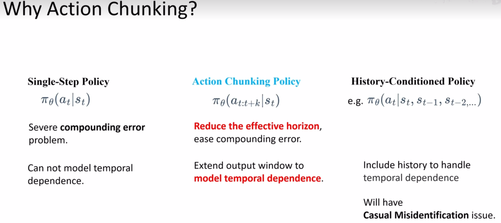
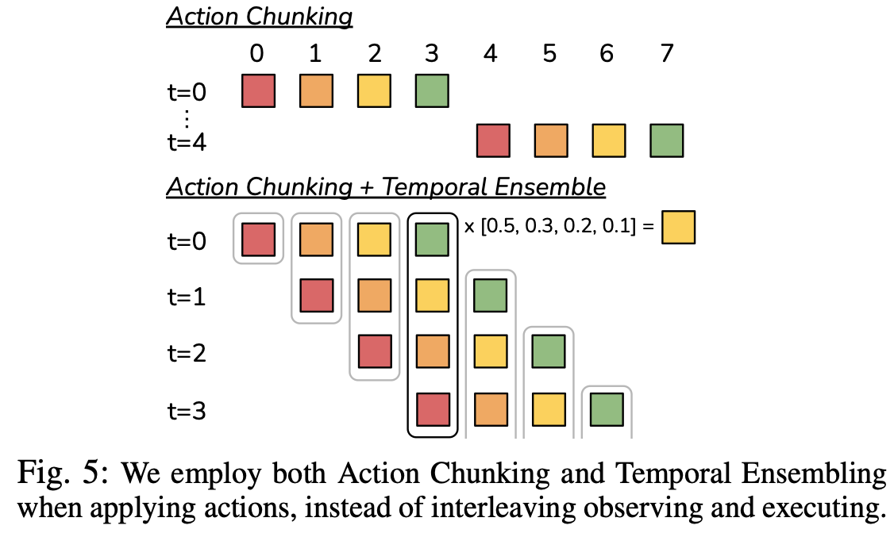
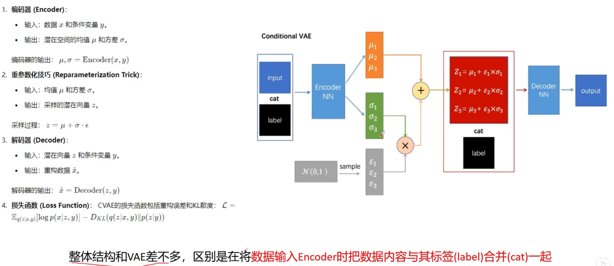
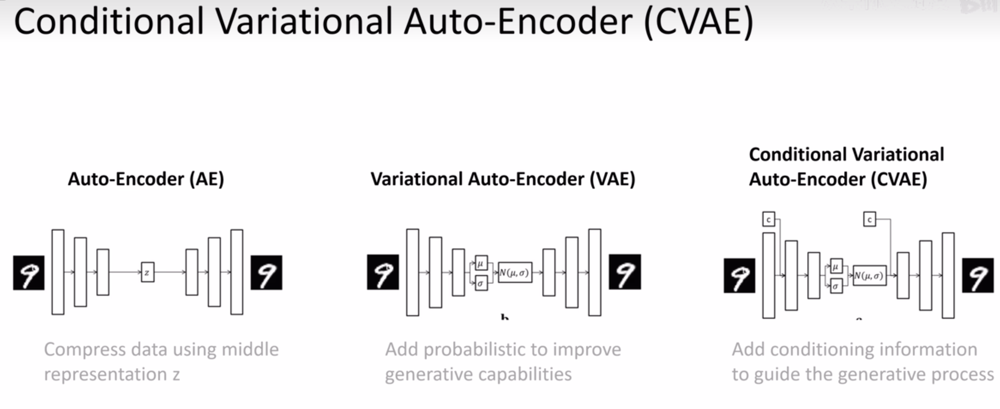
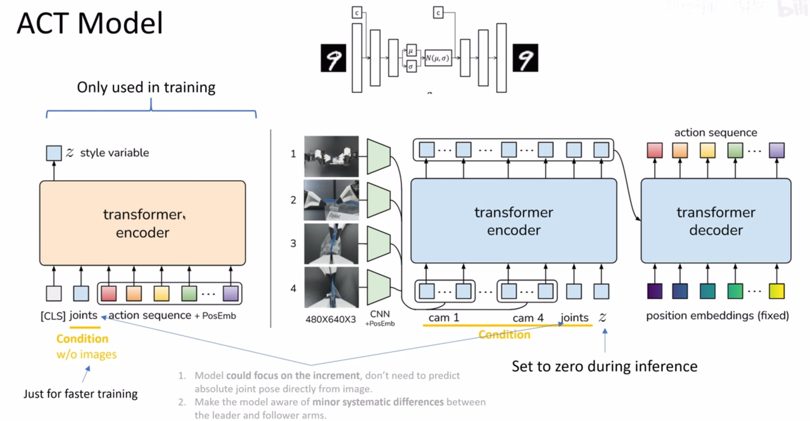
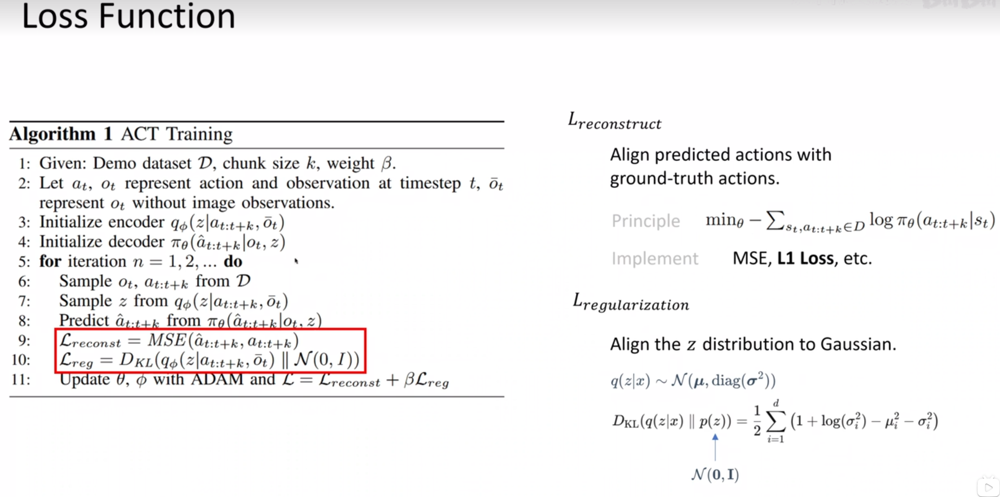

# 
Action Chunking with TransformSer

## 研究现状
模仿学习使机器人能够直接向专家学习。行为克隆 (Behavioral cloning，BC) 是最简单的模仿学习算法之一，BC 的一个主要缺点是**复合误差**（compounding errors）即先前time step误差不断累积，导致机器人偏离其训练分布，最终导致难以恢复的状态。作者开发了一种名为“基于 Transformer 的动作分块”（ACT）的新算法。

## Action Chunking and Temporal Ensemble

### Action Chunking
将各个action组合在一起并作为一个单元执行，来提高它们的存储和执行效率。直观地讲，一组动作可以对应于抓住糖果包装纸的一角或将电池插入插槽。在实验中将chunk size固定为 k ：每 k 步，agent都会收到一个观察结果，用来生成接下来的 k  个动作，并按顺序执行这些动作。这意味着任务的有效范围减少了 k 倍。具体而言，该策略对$\pi_{\theta}(a_{t:t+k}|s_t)$进行建模，而不是$\pi_{\theta}(a_t|s_t)$,分块还可以帮助模拟人类演示中的非马尔可夫行为(Non Markov)。具体来说，单步策略会难以应对时间相关的混杂因素，例如演示过程中的停顿，因为行为不仅取决于状态，还取决于时间步长。当混杂因素位于一个组块内时，动作组块可以缓解这个问题，而不会像历史条件策略那样引入因果混淆问题。

### Temporal Ensemble
提出了一个**时序集成**（Temporal Ensemble）来组合这些预测。时序集成使用指数加权方案$w_i = exp(-m*i)$,这是一个以i为变量，单调递减的函数，预测发生越久，其权重越大（t=0,权重为0.5），m是控制融合新信息的速度，m越小，融合越快。

## CVAE（conditional variational auto-encoder）
**AE**：是一种无监督学习方法，将高维的原始数据映射到一个潜在空间，用低维特征空间z表示，然后从低维特征学习重建原始数据，能够提取数据特征。
**VAE**：潜在空间用概率表示（正态分布），重新生成采样数据z；
**CVAE**：与VAE结构差不多，区别是将数据输入Encoder时把数据和其标签c合并在一起输入，输出解码也是将数据和标签一起合并输出；

另一个挑战是从嘈杂的人类演示中学习。给定相同的观察结果，人类可能会使用不同的轨迹来解决任务。在精度不太重要的区域，人类的随机性也会更强。因此，策略必须关注精度要求较高的区域。作者通过将**action chunking 策略**训练为生成模型来解决这个问题。策略训练为条件变分自编码器 (CVAE) ，以生成基于当前观察结果的动作序列。CVAE 包含两个组件：CVAE 编码器和 CVAE 解码器，

CVAE 编码器仅用于训练 CVAE 解码器（policy），并在测试时被丢弃。CVAE 编码器预测风格变量 z 分布的均值和方差，该分布被参数化为对角高斯分布，给定当前观察结果和动作序列作为输入。**为了在实践中加快训练速度，忽略了图像观测**，仅以本体感受观测和动作序列作为条件。CVAE 解码器，以 z 和当前观测（图像 + 关节位置）作为条件，预测动作序列。测试时将z设为先验分布的均值（即0）以实现确定性解码。

整个模型的训练目标是最大化演示action chunk的对数似然，即模仿学习loss=$min_{\theta} - \sum_{s_t,a_t:a_{t+k}\in D}log(\pi_{\theta}(a_{t:t+k}|s_t))$，标准 VAE 目标函数包含两个项：**重建损失函数和将编码器正则化为高斯先验的项**。 作者用超参数$\beta$ 加权第二项，$\beta$ 越高，z 中传输的信息量就越少。
重建损失函数：包括重建误差$L_{reconst}$（衡量原始真实动作序列action sequence与预测生成action sequence的相似性）和KL散度$L_{reg}$（衡量潜在空间的分布$q(z|x)$与标准正态分布$p(z)$的差异）

## ACT model

### Training
step 1 sample data:    
输入采样4路RGB图像，分辨率总像素为480\*640\*3，两个follower臂的自由度为7*2,输出动作序列为k*14；   
输出：动作序列是两个机械臂的绝对关节位置，共14维向量，k个动作便是k\*14张量；
step 2 infer z: encoder 的输入是当前**embeded joints**嵌入关节位置和来自演示数据集的长度为 k 的目标动作序列**embeded action sequence**，并在其前面附加一个学习到的类似于 BERT 的“[CLS]”标记（相当于标志位），它是随机初始化的学习权重组成。这形成了一个长度为 (k+2)\*512 的输入，并在CVAE的编码器进行处理，重参数化采样sample with reparametrimation；
$$
z \sim N(\mu,\sigma^2), \epsilon \sim N(0,1) \\
z = \mu + \sigma \epsilon
$$
step 3 predict action sequence:    
Transformer encoder首先使用 ResNet18 backbone 处理图像，将$480 \times640\times3$ 的 RGB 图像转换为 $15\times20\times512$ 个特征图。然后，沿空间维度展平以获得 $300\times512$ 的序列。为了保留空间信息，在特征序列中添加了一个二维sinusoidal position embedding。对所有 4 幅图像重复此操作，可得到维度为$1200\times512$ 的特征序列。然后再添加两个特征：**当前关节位置和“风格变量”z** 分别通过线性层从原始维度投影到 512。至此，Transformer 编码器的输入为 $1202\times512$。      
Transformer decoder通过交叉注意对encoder输出进行条件设置，其中输入序列是固定位置嵌入，维度为$k\times512$，key和value来自encoder。这为 Transformer decoder提供了$k\times512$ 的输出维度，然后使用 MLP 将其向下投影到 $k\times14$，对应于接下来 k步的预测目标关节位置，使用 L1 损失进行重建，而不是更常见的 L2 损失：因为 L1 损失可以更精确地建模动作序列，同时当使用增量关节位置而不是目标关节位置作为动作时，性能会下降。
Testing: 风格变量z设为固定值0

