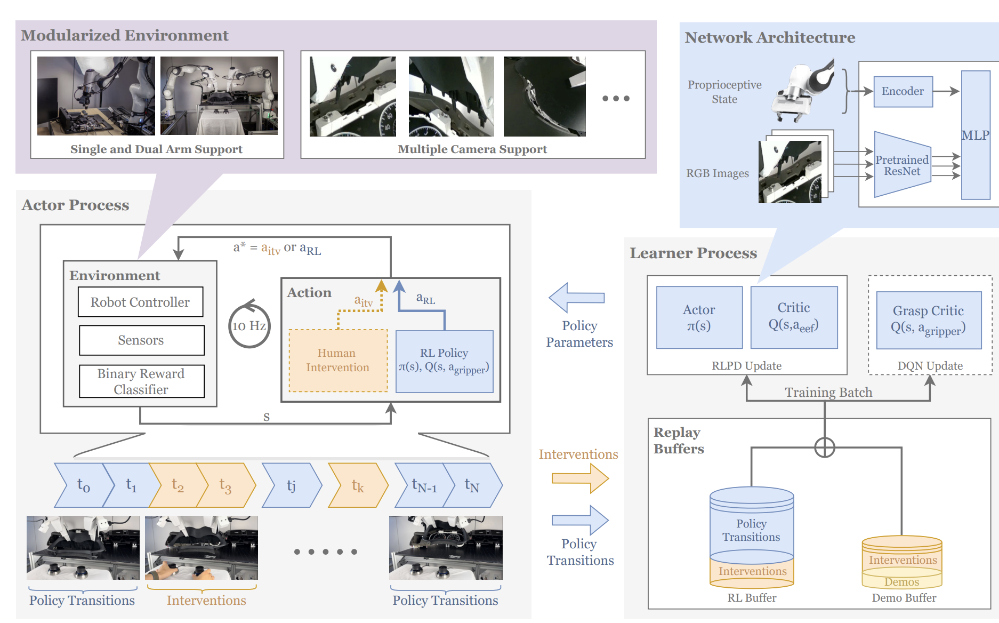
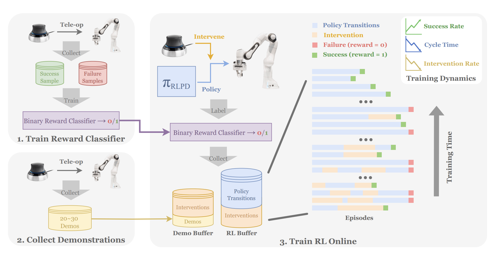
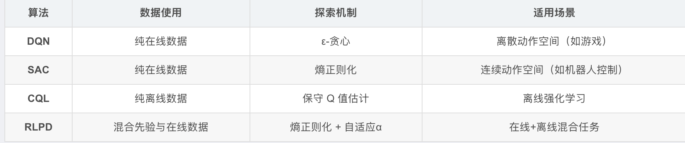

# 
HIL-SERL

## 系统架构
我们的系统由三个主要组件组成：执行器进程（actor process）、学习器进程（learner process）以及位于学习器进程中的回放缓冲区（replay buffer），所有组件都以分布式方式运行

学习器进程从两个回放缓冲区中均匀采样数据，并使用RLPD更新策略。当需要夹爪控制时，还会通过DQN额外训练一个抓取评价器（grasp critic）。

首先，如左上角所示，Train Reward Classifier，通过远程操作机器人，收集正样本和负样本，并训练一个二元奖励分类器
随后，如左下角所示，Collect Demonstrations，即收集一小部分演示数据，并在强化学习训练开始时将其加入演示缓冲区
最后，如上图整块右侧所示，Train RL Online，在在线训练过程中，使用二元分类器作为稀疏奖励信号，并提供人工干预，最初，会比较频繁地进行干预，以从不同状态演示任务的解决方法。随着策略的成功率提高和循环时间加快，可逐步减少干预次数

## 执行器进程（actor process）
执行器进程通过在机器人上执行当前策略与环境交互，并将数据回传至回放缓冲区。需要实现一个奖励函数来评估任务的成功与否。
### 环境environment
环境被设计为模块化（Modularized Environment），可灵活配置各种设备。这包括支持多摄像头的集成(Mutiple cameras support)、输入设备（如用于远程操作的SpaceMouse）的连接，以及控制不同类型控制器的可变数量的机器人手臂的能力(Single and Dual arm)。
#### 奖励函数Binary Reward classifer
强化学习系统的一个关键部分是奖励函数，它用于指导学习过程并评估策略的质量。尽管已有研究利用奖励塑形（reward shaping）来加速学习过程，但这一过程通常特定于任务，且设计起来耗时复杂。在一些复杂任务中，进行奖励塑形甚至是不现实的。我们发现，结合稀疏奖励函数、人类示范和人类修正，为各种任务提供了一种简单且有效的设置。
当奖励信号只在极少数情况下才出现（例如任务完全成功时才给 1，否则全是 0）， 这样的奖励函数就叫做 稀疏奖励函数（SparseReward Function）。具体而言，我们收集离线数据并为每个任务训练一个二元分类器，该分类器仅在任务完成时授予正奖励，否则奖励为零。

## learn process学习器进程
学习器进程从示范缓冲区和RL回放缓冲区中均匀采样数据，使用RLPD优化策略，并定期将更新后的策略发送至执行器进程。
### RLPD  Update(Reinforcement Learning with Prior Data)更新 
RLPD 从先验数据和在线策略数据中均匀采样，形成训练批次。然后，它基于各自的损失函数梯度更新参数化Q函数$Q_{\phi}(s,a)$和策略$\pi_{\theta}(a|s)$ 的参数. 它的特点有：
- 混合数据训练：同时利用先验数据和在线数据，提升样本效率。
- 熵正则化策略优化：通过自适应熵项平衡探索与利用。
- 目标网络稳定训练：减少 Q 值估计的波动。    

RLPD与其他算法的区别

#### Q函数更新(Critic)  
$$
\mathcal{L}_\mathcal{Q}(\phi)=\mathbb{E}_{s,a,s'}\left[\left(\mathcal{Q}_{\phi}(s,a)-(r(s,a)+\gamma\mathbb{E}_{a'\sim\pi_{\theta}}[\mathcal{Q}_{\bar{\phi}}(s',a')])\right)^2\right]\tag{1} 
$$
其中Q函数使用sarsa贝尔曼方程形式,使用均方误差损失： 最小化当前 Q 值与目标值的损失，$\mathcal{Q}_{\bar{\phi}}$是一个目标网络计算未来 Q 值。
$$
\mathcal{L}_{\pi}(\theta)=-\mathbb{E}_{s}\left[\mathbb{E}_{a\sim\pi_{\theta}(a)}[\mathcal{Q}_{\phi}(s,a)]+\alpha \mathcal{H}(\pi_{\theta}(\cdot|s))\right]\tag{2}
$$
而策略的损失函数通过引入熵正则化来促进探索，正则化权重$\alpha$会根据情况自适应调整

#### 策略更新(Actor)
最大化 Q 值期望： 策略$\pi_\theta$应选择使$\mathcal{Q}_\phi(s,a)$最大的动作
$$
\max_\theta \mathbb{E}_{a \sim \pi_\theta} [\mathcal{Q}_\phi(s,a)]
$$
熵正则化： 引入熵项$\mathcal{H}(\pi_\theta(\cdot|s)) = -\sum_a \pi_\theta(a|s) \log \pi_\theta(a|s)$鼓励探索，防止策略过早收敛到局部最优      
$$
\max_\theta \mathbb{E}_{a \sim \pi_\theta} [\mathcal{Q}_\phi(s,a)] + \alpha \mathcal{H}(\pi_\theta(\cdot|s))
$$
转化为损失函数： 将最大化问题转化为最小化负值：
$$
\mathcal{L}_{\pi}(\theta)=-\mathbb{E}_{s}\left[\mathbb{E}_{a\sim\pi_{\theta}(a)}[\mathcal{Q}_{\phi}(s,a)]+\alpha \mathcal{H}(\pi_{\theta}(\cdot|s))\right]
$$

### 夹爪控制(DQN Update)
对于涉及夹爪控制的任务，我们采用了一个独立的评价网络（critic network）来评估离散的抓取动作。评价网络更新，遵循标准的DQN方法，并通过引入目标网络（target network）来稳定训练，如下所示：
$$
\mathcal{L}(\theta)=\mathbb{E}_{s,a,s'}\left[\left(r+\gamma \mathcal{Q}_{\theta'}(s',\arg\max_{a'}\mathcal{Q}_{\theta}(s',a'))-\mathcal{Q}_{\theta}(s,a)\right)^2\right]\tag{3}
$$
其中$\theta'$是目标网络的参数，可以通过对当前网络参数进行Polyak平均化获得  

DQN适用于离散空间，夹爪的离散动作空间，可能的动作包括：
单个夹爪：{"打开", "关闭", "保持不变"} → 3 种动作
双夹爪：3^2 = 9 种可能的组合动作，例如：
(打开, 打开)
(打开, 关闭)
(关闭, 关闭)
(保持, 关闭)
…
为什么使用离散动作空间？
夹爪的操作通常是有限状态的，不需要连续的值来表示

### 双马尔可夫决策过程（Two MDPs）
为了在强化学习中处理连续的机械臂控制和离散的夹爪控制，本文引入了两个独立的马尔可夫决策过程（MDPs），分别处理：
$\mathcal{M}_1$：连续动作空间（机械臂运动）
$\mathcal{M}_2$：离散动作空间（夹爪控制）
定义 马尔可夫决策过程（MDP）通常表示为：$ \mathcal{M} = \{\mathcal{S}, \mathcal{A}, \rho, \mathcal{P}, r, \gamma\}$
其中：
$\mathcal{S}$：状态空间（state space），包含机器人观察到的图像、本体感知、夹爪状态等。
$\mathcal{A}$：动作空间（action space），分为连续动作空间$\mathcal{A}_1$（机械臂）和离散动作空间$\mathcal{A}_2$（夹爪）。
$\rho$：初始状态分布（initial state distribution）。
$\mathcal{P}$：状态转移概率（state transition function）。
r：奖励函数（reward function）。
$\gamma$：折扣因子（discount factor），控制长期奖励的权重。
机械臂的运动是连续的，因此其策略采用标准的连续强化学习方法（如 DDPG、PPO）。
夹爪的动作是离散的，因此它的策略采用Q-learning 变种，如 DQN
### replay buffer回放缓冲区
使用了两个回放缓冲区：
示范缓冲区（demo buffer）：用于存储离线的人类示范数据，通常数量在20到30之间；
RL缓冲区（RL buffer）：用于存储在线策略生成的数据。
数据采样机制
replay buffer混合采样：每个训练批次（Batch）中，50% 数据来自先验数据集$\mathcal{D}_{\text{prior}}$（如专家演示、历史经验），50% 数据来自在线策略$\pi_\theta$与环境交互的实时数据$\mathcal{D}_{\text{online}}$

## 网络机构Network Architecture  
神经网络架构使用相同的预训练视觉骨干网络处理来自多台摄像头的图像。具体来说，我们使用了ResNet-10模型，该模型在ImageNet数据集上进行过预训练，以生成输出嵌入。这些嵌入随后被连接起来，并进一步与处理后的本体感知信息结合，从而促进了更高效、更有效的学习过程。   
- 预训练的视觉骨干网络是指在大规模数据集上预训练的神经网络，用于从图像中提取特征，常用于计算机视觉和强化学习任务。
- 使用预训练的 ResNet-10 可以加速学习，提高稳定性，并减少对大规模数据的依赖，特别适用于机器人强化学习。
- 在强化学习中，视觉骨干网络可以增强探索效率，并结合本体感知信息，提高模型的决策能力。
- 多摄像头融合：论文使用多个摄像头数据，通过 ResNet-10 处理后进行嵌入拼接，并结合机器人自身状态信息，最终输入强化学习策略网络

