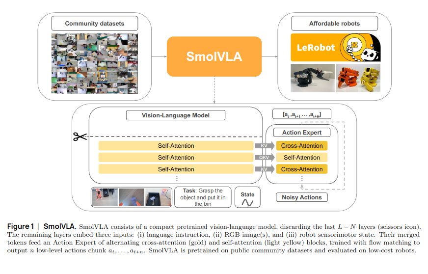
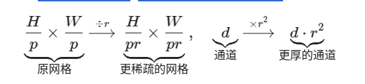
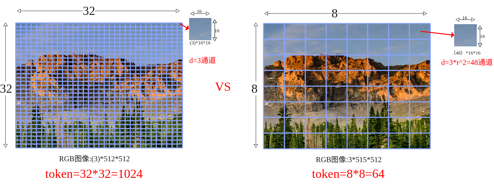
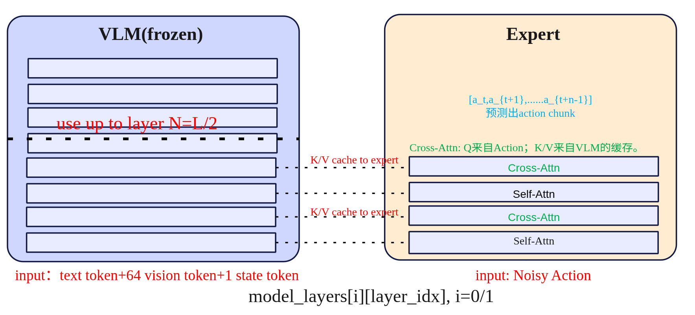
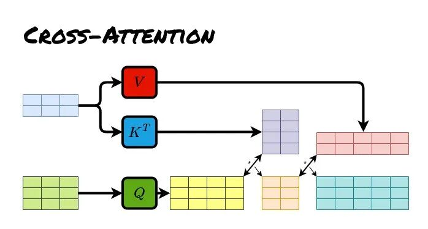
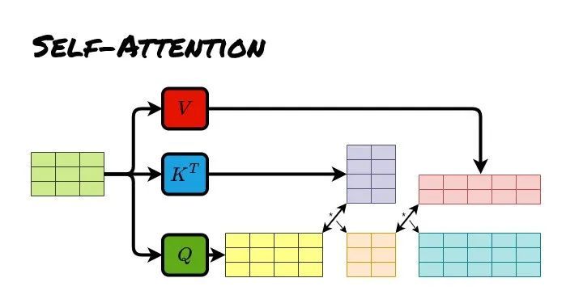

# 
smolvla

## 研究现状
SmolVLA 是一套轻量级视觉-语言-行动（VLA）策略：前端用小型 VLM（视觉 SigLIP + 语言 SmolLM2）做感知与理解；后端用一个“动作专家”专门预测一段连续的低层控制。它与Pi0相比，参数规模少了将近10倍只有约0.45B（450M）。

## 原理

模型结构主要有前端的VLM+后端的动作专家Action Expert组成，包括以下组件：
输入：文本指令token+视觉token（多摄像头采集的图像）+机器的状态token（关节角、传感器）。
VLM（感知端）：语音采用SmolVLM-2，VLM共有L层，但是只N=⌊L/2⌋层隐藏表示喂给动作专家，视觉采用SigLIP。
Action Expert（控制端）：一个Flow Matching Transformer，以以Cross Attention→  Self Attention→ Cross Attention的“三明治”层为基本单元，按块预测n步动作序列。
输出：一次预测长度为n的动作块，对应机器的控制指令。

SmolVLA与Pi0有很多相似之处，不过其背后有四个关键设计，分别是Layer Skipping（层跳过）、Visual tokens reduction（视觉token压缩）、动作专家交替Self-Attn与Cross-Attn、异步推理。

## 层跳过Layer Skipping
层跳过就是把感知端的VLM（视觉+语言）的解码器中间层拿来当条件特征，具体的做法就是只去$N=L/2$层的隐藏层表示送给动作专家，VLM权重冻结不训练。把“文本指令 token、图像 token、状态 token”拼接，送入解码器；在第N层获取特征信息H，然后用一个线性投影到Action expert所需的维度$d_a$作为$K/V$。   

## 视觉token压缩  
在transformer里面，“token”就是序列里的一个位置。对图像来说，我们把一张图拆成很多小块（patch）或网格上的特征点，每个块/点用一个向量表示，这个向量就是视觉token，设patch的特征图大小为$\frac{H}{p} \times \frac{W}{p} \times d$,选一个下采样因子r (整数)，做 space-to-depth：

压缩过程如下：
输入图像尺寸为$512\times512$
patch大小为$p=16 \Rightarrow 32 \times 32$
下采样因子选择$r = 4 \Rightarrow \frac{32}{4} \times \frac{32}{4} = 8 \times 8 =64$ 为特征图大小（token数量）    
则通道数为$d = 3 \times 4^2 = 48$
总结一下smolvla在视觉token上进行了压缩，使用space-to-depth，对于512X512的图每帧token从1024降低到了64帧,通道数从3变成48。

## 动作专家Expert交替Self-Attention与Cross-Attention
在动作专家中使用了交叉注意力机制，具体的排布可以配置。VLM的每一层与右边的Expert是一一对齐的，下图以VLM和Expert都为4层来示例交替注意力的实现。

**自注意力Self-Attn**（管自己，守时序）：只允许第 i 步看 ≤i 的历史步（因果掩码），在动作序列内部传播动力学与约束，做轨迹的时间一致性与平滑。在计算注意力时，会将VLM的QKV与Expert的QKV进行拼接起来一起送入transformer计算，但通过掩码保证 VLM 的Q只看自己（不去读 Expert），而 Expert 的 Q 可以访问 VLM 的 K/V（即“读”VLM 语义），这样既提供了计算效率也提升了Expert的语义丰富性。
**交叉注意力Cross-Attn**（看环境，取证）：看环境取证，让每个动作 token 先从条件特征里“读”一遍（条件特征=VLM中间层输出，含文本指令+多路视觉+状态）。这样动作表示一开始就被场景锚定，知道当下该关注哪里/哪件物体。具体是交叉注意力计算Q来自Expert Action自己，而K/V 来自 VLM 对应层的输出缓存。

### 区别
#### 输入源不同
Cross Attention：来自两个不同的序列，一个来自编码器，一个来自解码器

Self Attention：来自编码器的同一序列

#### 实现目标
Cross Attention：解码器序列用作查询（$Q_d$），编码器序列提供键（$K_e$）和值（$V_e$），用于在编码器-解码器两个不同序列之间进行注意力转移(信息融合)，假设输入特征为X，交叉注意力分数等于。
$$
\text{Self Attention}(Q_d, K_e, V_e) = \text{softmax}\left(\frac{Q_dK^T_e}{\sqrt{d_k}}\right)V_e \\
Q_d = w_qX_d \\
K_e = w_kX_e  \\
V_e = w_vX_e 
$$
Self Attention：查询（Q）、键（K）和值（V）均来自编码器同一序列，实现编码器序列内部的注意力计算，适用于语言建模、图像处理等任务。Transformer 编码器中的注意力层即为典型的自注意力机制，其中每个词对其它所有词都施加不同程度的关注。假设输入特征为X，子注意力分数等于：
$$
\text{Self Attention}(Q, K, V) = \text{softmax}\left(\frac{QK^T}{\sqrt{d_k}}\right)V \\
Q = w_qX \\
K = w_kX  \\
V = w_vX
$$
其中$d_k$ 是 Key 向量的维度，用于防止分数过大导致梯度消失