# <center>smolvla</center>

## 研究现状
SmolVLA 是一套轻量级视觉-语言-行动（VLA）策略：前端用小型 VLM（视觉 SigLIP + 语言 SmolLM2）做感知与理解；后端用一个“动作专家”专门预测一段连续的低层控制。它与Pi0相比，参数规模少了将近10倍只有约0.45B（450M）。

## 原理

模型结构主要有前端的VLM+后端的动作专家Action Expert组成，包括以下组件：
输入：文本指令token+视觉token（多摄像头采集的图像）+机器的状态token（关节角、传感器）。
VLM（感知端）：语音采用SmolVLM-2，VLM共有L层，但是只N=⌊L/2⌋层隐藏表示喂给动作专家，视觉采用SigLIP。
Action Expert（控制端）：一个Flow Matching Transformer，以以Cross Attention→  Self Attention→ Cross Attention的“三明治”层为基本单元，按块预测n步动作序列。
输出：一次预测长度为n的动作块，对应机器的控制指令。
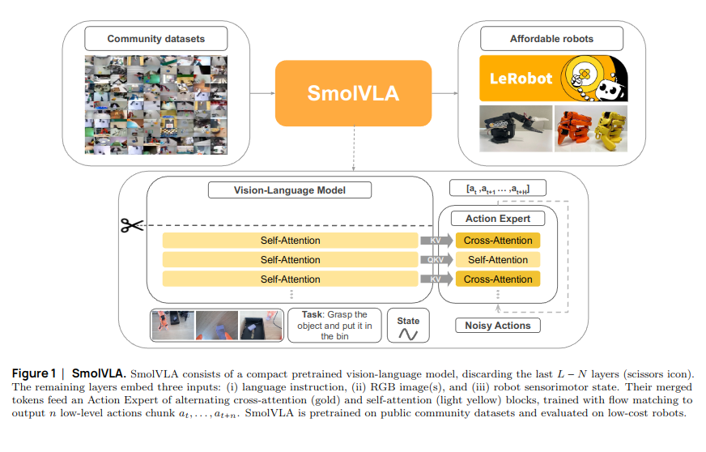
SmolVLA与Pi0有很多相似之处，不过其背后有四个关键设计，分别是Layer Skipping（层跳过）、Visual tokens reduction（视觉token压缩）、动作专家交替Self-Attn与Cross-Attn、异步推理。

## 层跳过Layer Skipping
层跳过就是把感知端的VLM（视觉+语言）的解码器中间层拿来当条件特征，具体的做法就是只去$N=L/2$层的隐藏层表示送给动作专家，VLM权重冻结不训练。把“文本指令 token、图像 token、状态 token”拼接，送入解码器；在第N层获取特征信息H，然后用一个线性投影到Action expert所需的维度$d_a$作为$K/V$。   

## 视觉token压缩  
在transformer里面，“token”就是序列里的一个位置。对图像来说，我们把一张图拆成很多小块（patch）或网格上的特征点，每个块/点用一个向量表示，这个向量就是视觉token，设patch的特征图大小为$\frac{H}{p} \times \frac{W}{p} \times d$,选一个下采样因子r (整数)，做 space-to-depth：
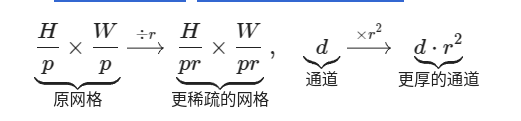
压缩过程如下：
输入图像尺寸为$512\times512$
patch大小为$p=16 \Rightarrow 32 \times 32$
下采样因子选择$r = 4 \Rightarrow \frac{32}{4} \times \frac{32}{4} = 8 \times 8 =64$ 为特征图大小（token数量）    
则通道数为$d = 3 \times 4^2 = 48$
总结一下smolvla在视觉token上进行了压缩，使用space-to-depth(pixel shuffle)，对于512X512的图每帧token从1024降低到了64帧,通道数从3变成48。
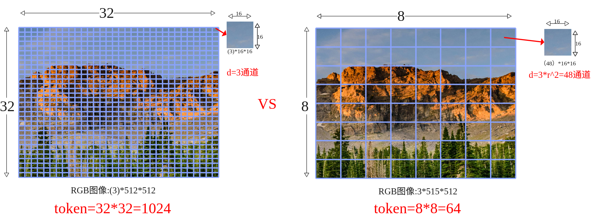

## 动作专家Expert交替Self-Attention与Cross-Attention
交叉注意力层的工作：

动作token与VLM特征进行交互，从图像和语言中获取任务相关信息

动作token会"询问"VLM：“任务要求是什么？”
VLM回答：“需要拿起红色的杯子，杯子在图像的右上角”
动作token获得了任务的具体要求    

自注意力层的工作：

动作序列中的每个动作会关注之前的动作，确保整个动作序列是合理的（比如先伸手，再抓取，最后提起）。在SmolVLA中，每次处理一个包含50个时间步（假设chunk_size=50）的动作序列。自注意力层让这个序列中的每个时间步都能关注它之前的所有时间步：

第1个时间步的动作token：作为序列的开始，只能基于任务信息决定动作
第2个时间步的动作token：可以关注第1个时间步，基于"第1步做了什么"来决定"第2步应该做什么"
第3个时间步的动作token：可以关注第1、2个时间步，基于"前两步的动作序列"来决定"第3步应该如何继续"
第t个时间步的动作token：可以关注第1到第t-1个时间步的所有动作，基于完整的历史动作序列来决定当前时间步的动作
通过这种因果自注意力机制，确保了动作序列在时间上的连贯性和逻辑性，每个时间步的动作都能充分考虑之前的动作历史，但不会"预知"未来的动作。     

在动作专家中使用了交叉注意力机制，具体的排布可以配置。VLM的每一层与右边的Expert是一一对齐的，下图以VLM和Expert都为4层来示例交替注意力的实现。
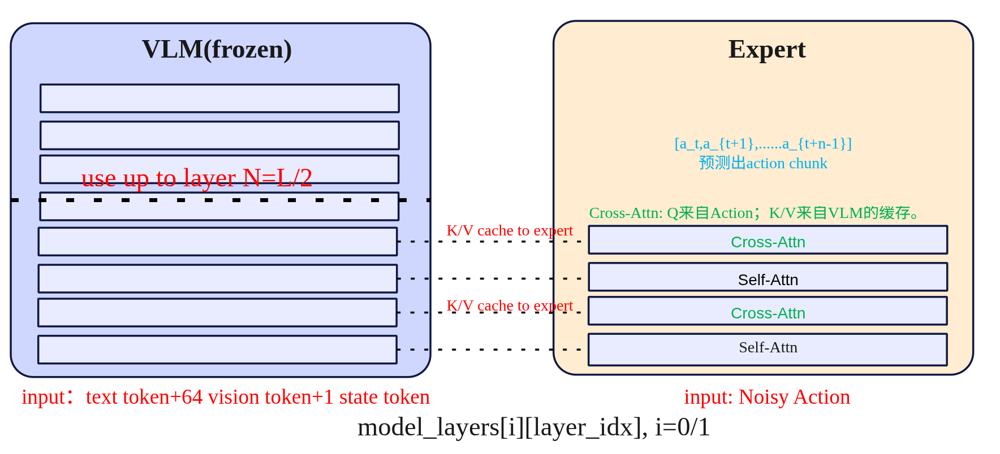
**自注意力Self-Attn**（管自己，守时序）：只允许第 i 步看 ≤i 的历史步（因果掩码），在动作序列内部传播动力学与约束，做轨迹的时间一致性与平滑。在计算注意力时，会将VLM的QKV与Expert的QKV进行拼接起来一起送入transformer计算，但通过掩码保证 VLM 的Q只看自己（不去读 Expert），而 Expert 的 Q 可以访问 VLM 的 K/V（即“读”VLM 语义），这样既提供了计算效率也提升了Expert的语义丰富性。
**交叉注意力Cross-Attn**（看环境，取证）：看环境取证，让每个动作 token 先从条件特征里“读”一遍（条件特征=VLM中间层输出，含文本指令+多路视觉+状态）。这样动作表示一开始就被场景锚定，知道当下该关注哪里/哪件物体。具体是交叉注意力计算Q来自Expert Action自己，而K/V 来自 VLM 对应层的输出缓存。

### 区别
#### 输入源不同
Cross Attention：来自两个不同的序列，K/V值来自编码器输入量$X_e$,Q值来自解码器数量$X_d$
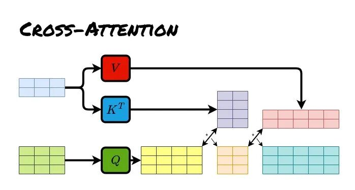
Self Attention：K/V/Q来自编码器的同一序列
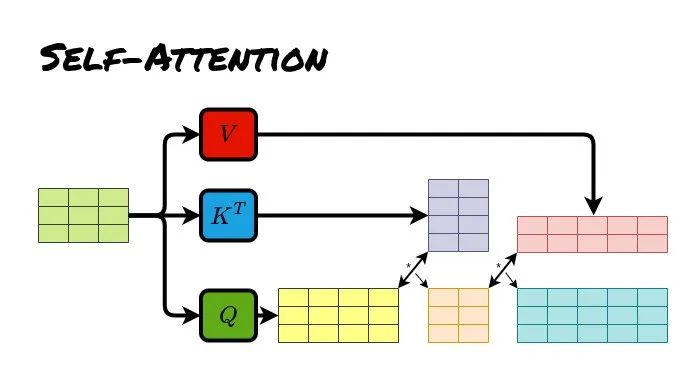
#### 实现目标
Self Attention：允许序列内部每个 token 动态关注其他 token（包括自己）。捕捉序列内的长距离依赖和上下文关系，例如句子中词与词的相关性。查询（Q）、键（K）和值（V）均来自编码器同一序列X，实现编码器序列内部的注意力计算，适用于语言建模、图像处理等任务。Transformer 编码器中的注意力层即为典型的自注意力机制，其中每个词对其它所有词都施加不同程度的关注。假设输入特征为X，$w_q,w_k,w_v$需要训练的参数权重矩阵,子注意力分数等于：
$$
\text{Self Attention}(Q, K, V) = \text{softmax}\left(\frac{QK^T}{\sqrt{d_k}}\right)V \\
Q = w_qX \\
K = w_kX  \\
V = w_vX
$$
其中$d_k$ 是 Key 向量的维度，用于防止分数过大导致梯度消失,这个Attention公式描述为：Scaled Dot-Product Attention。
Cross Attention：实现两个不同序列之间的信息交互和对齐,Decoder使用Encoder的上下文信息生成输出.解码器序列$X_d$用作查询（$Q_d$），编码器序列$X_e$提供键（$K_e$）和值（$V_e$），用于在编码器-解码器两个不同序列之间进行注意力转移(信息融合)，$w_q,w_k,w_v$需要训练的参数权重矩阵,交叉注意力分数等于。
$$
\text{Self Attention}(Q_d, K_e, V_e) = \text{softmax}\left(\frac{Q_dK^T_e}{\sqrt{d_k}}\right)V_e \\
Q_d = w_qX_d \\
K_e = w_kX_e  \\
V_e = w_vX_e 
$$

#### QKV作用
Q 决定关注目标，K 决定匹配关系，V 决定信息内容
自注意力建模序列内部关系，交叉注意力实现跨序列信息对齐
Query (Q)：当前 token（词或位置）的“查询向量”，代表“我在寻找什么信息”。
Key (K)：其他 token 的“键向量”，代表“这个位置能提供什么信息”（用于匹配）。
Value (V)：其他 token 的“值向量”，代表“实际要聚合的信息内容”。

### 因果掩码：防止"时间旅行"
在自注意力层中，SmolVLA使用了一个重要的技术：因果掩码(Causal Mask)。
```
时间轴：  t1    t2    t3    t4    t5
动作：   伸手  张开  接近  抓取  提起

在t3时刻（接近杯子）：
✅ 可以参考：t1（伸手）、t2（张开）
❌ 不能参考：t4（抓取）、t5（提起）

```   
1. 防止信息泄露
如果允许t3时刻的动作"看到"t4和t5的动作，就像是在考试时偷看答案。在训练时，模型可能会"作弊"，利用未来的信息来预测当前的动作。但在实际应用中，机器人不可能知道未来会发生什么。

2. 保持时序逻辑
机器人的动作必须按照物理规律执行。你不能在还没伸手的时候就开始抓取，也不能在还没抓住的时候就开始提起。因果掩码确保了动作的逻辑顺序。

3. 支持自回归生成
在实际应用中，机器人需要一步一步地生成动作序列。因果掩码让模型能够在只知道前面动作的情况下，预测下一个动作。

## 基于流匹配动作专家Flow Matching Action Expert
### 概念
在理解Flow Matching之前，让我们先从一个生活中的例子开始。想象你有一团橡皮泥，你想把它从一个圆形慢慢变成一个正方形。在这个变形过程中，橡皮泥的每一个点都在移动，而且这个移动过程是连续的、平滑的。
现在，如果我们用数学的语言来描述这个过程：
- 圆形是我们的"初始状态"，用数学符号表示为$x_0$;
- ​正方形是我们的"目标状态"，用数学符号表示为$x_1$;
- 变形过程中的每个中间状态可以用$x_t$表示，其中t是时间参数，从0变化到1;

这里的关键概念是：我们需要找到一个"变形规则"，告诉橡皮泥上的每一个点在每个时刻应该朝哪个方向移动，移动多快。这个"变形规则"在数学上就叫做向量场，用符号$u_t(x_t)$ 表示。
### 常微分方程描述连续变换
这个连续变形过程可以用一个常微分方程(ODE)来精确描述：
$$
\frac{dx_t}{dt} = u_t(x_t)
$$
其中$x_t$表示在时间t时刻的状态（比如橡皮泥上某个点的位置）,$\frac{dx_t}{dt}$这是微积分中的导数记号，表示$x_t$随时间t的变化率，也就是"速度",$u_t(x_t)$向量场函数，输入当前时间t和当前位置$x_t$，输出在这个时空点应该移动的方向和速度.
### Flow Matching的核心创新
Flow Matching的创新之处在于提供了一种"无仿真"的训练方法。它不需要每次都完整地求解ODE，而是直接学习向量场$u_t(x_t)$,这就像是：我们不需要每次都完整地变形橡皮泥，而是直接学习"在任何给定的时刻和位置，应该朝哪个方向移动"这个规则本身。
### 条件流匹配(Conditional Flow Matching)
直接学习向量场$u_t(x_t)$面临一个根本问题：我们不知道真实的向量场应该是什么样的。这就像是我们想学习橡皮泥变形的规则，但我们不知道"正确答案"是什么。     
条件流匹配(Conditional Flow Matching, CFM)巧妙地解决了这个问题。它的核心思想是：虽然我们不知道整体的向量场，但我们可以为每一对起点和终点设计一个简单的路径。
假设我们知道一个数据点的起点$x_0$和终点$x_1$，我们可以设计一条从$x_0$到$x_1$的简单路径。最直观的选择是直线路径
$$
x_t = (1-t) \cdot x_0 + t \cdot x_1
$$

对应的向量场（即移动方向）可以通过求导得到：：
$$
u_t(x_t | x_1) = \frac{d}{dt}[(1-t) \cdot x_0 + t \cdot x_1] = -x_0 + x_1 = x_1 - x_0
$$
这个结果非常直观：无论在路径的哪个位置，移动方向都是从起点指向终点的向量。
### 际向量场的构造
现在我们有了每一对起点-终点的条件向量场，但我们需要的是整体的向量场。CFM通过取期望来解决这个问题：    
$$
u_t(x) = \mathbb{E}_{x_1 \sim q_1}[u_t(x | x_1)]
$$
其中$q_1$是目标数据分布（比如我们想要生成的图像分布）,$x_1 \sim q_1$表示从目标分布中采样一个数据点,$u_t(x | x_1)$是给定终点$x_1$时的条件向量场,$\mathbb{E}$表示期望值，即对所有可能的终点取平均
这个公式的含义是：在位置x和时间t，整体向量场等于所有可能条件向量场的加权平均，权重由目标分布决定。

### 高斯概率路径  
在实际应用中，纯粹的直线路径可能过于简单。SmolVLA采用了高斯概率路径，在直线路径的基础上加入了随机性：
$$
x_t = (1-t) \cdot x_0 + t \cdot x_1 + \sigma_t \cdot \epsilon
$$
其中$\sigma_t$时间相关的噪声水平，通常随时间递减,$\epsilon \sim \mathcal{N}(0,1)$标准正态分布的随机噪声,
这个公式的含义是：在直线路径的基础上，加入一些随机扰动。这种设计有两个好处：
- 增加路径的多样性，避免所有数据点都走完全相同的路径
- 提高模型的鲁棒性，使其能够处理带有噪声的输入

对应的条件向量场为：
$$
u_t(x_t | x_1) = \frac{x_1 - (1-\sigma_t^2) x_t}{\sigma_t^2}
$$
当噪声水平$\sigma_t$很小时，这个公式近似为：
$$
u_t(x_t | x_1) \approx x_1 - x_t
$$
这意味着向量场指向从当前位置到目标位置的方向，这是一个非常直观的结果。

### Flow Matching的训练目标
有了条件向量场的概念，我们现在可以定义Flow Matching的训练目标。我们希望训练一个神经网络$v_\theta(x_t, t)$来近似真实的向量场$u_t(x_t)$训练损失函数为：
$$
\mathcal{L}(\theta) = \mathbb{E}_{t, x_0, x_1, \epsilon}[\|v_\theta(x_t, t) - u_t(x_t | x_1)\|^2]
$$
其中L2范数的平方，即欧几里得距离的平方，用来衡量预测值和真实值之间的差距   
$\theta$神经网络的参数（权重和偏置）;  
$v_\theta(x_t, t)$神经网络预测的向量场，输入是当前状态$x_t$和时间t;   
$u_t(x_t | x_1)$真实的条件向量场（我们的"标准答案"）
### 动作序列的噪声化过程
在SmolVLA中，机器人的动作序列被表示为$A_t = (a_t, a_{t+1}, \ldots, a_{t+n})$,其中$a_i$是一个动作向量（包含关节角度、末端执行器位置等信息）。为了应用Flow Matching，SmolVLA将真实动作序列进行噪声化：
$$
A^{\tau}_{t}=\tau A_{t}+(1-\tau)\epsilon, \epsilon\in N(0,I)
$$
其中
$A_{t}$真实的动作序列（我们的目标）    
$\epsilon\in N(0,I)$从标准正态分布采样的噪声序列    
$\tau \in [0 ,1]$噪声水平参数，控制噪声和真实动作的混合比例     
$A^{\tau}$噪声化后的动作序列     
这个公式含义就是  
当 $\tau = 0$ 时：$A_t^0 = 0 \cdot \epsilon + 1 \cdot A_t = A_t$ （纯真实动作）
当 $\tau = 1$ 时：$A_t^1 = 1 \cdot \epsilon + 0 \cdot A_t = \epsilon$（纯噪声）
当 $\tau = 0.3$ 时：$A_t^{0.3} = 0.3 \epsilon + 0.7 A_t$ （30%噪声 + 70%真实动作）
对应的条件向量场为：
$$
u(A_t^\tau | A_t) = \epsilon - A_t
$$
这个向量场的含义是：无论当前处于哪个噪声水平，移动方向都是从噪声指向真实动作。这是一个非常直观的结果：我们希望从随机的动作逐渐变成有意义的动作。
### SmolVLA的损失函数
根据论文，SmolVLA的训练损失函数为：
$$
\mathcal{L}^{\tau}(\theta)=\mathbb{E}_{p(A_{t}|o_{t}),q(A^{\tau}_{t}|A_{t})} [\|v_{\theta}(A^{\tau}_{t},o_{t})-u(A_{t}^{\tau}|A_{t})\|]^{2}
$$
其中
$\mathcal{L}^{\tau}(\theta)$损失函数，上标 $\tau$ 表示这是针对特定噪声水平的损失    
$p(A_{t}|o_{t})$给定观察 $o_t$（包括图像、语言、状态）时真实动作序列$A_t$的分布
$q(A^{\tau}_{t}|A_{t})$给定真实动作$A_t$时噪声动作$A_t^\tau$的分布
$v_{\theta}(A^{\tau}_{t},o_{t})$Action Expert网络预测的向量场
$u(A^{\tau}_{t}|A_{t})=\epsilon-A_{t}$真实的条件向量场为

这个损失函数的训练过程：

- 从数据集中采样一个观察-动作对$(o_t,A_t)$
- 采样噪声 $\epsilon$ 和噪声水平 $\tau$
- 计算噪声动作$A^{\tau}_{t}=\tau A_{t}+(1-\tau)\epsilon$
- 计算真实向量场$u(A^{\tau}_{t}|A_{t})=\epsilon-A_{t}$
- 让网络预测向量场$v_{\theta}(A^{\tau}_{t},o_{t})$
- 计算预测值和真实值之间的MSE损失

```shell
#假设原始数据如下：
#步骤一
任务描述: "pick up the red cup"
图像: 640×480 RGB图像，显示桌面上的红色杯子
真实动作序列: 50个时间步，每个动作7维（x, y, z, roll, pitch, yaw, gripper）
[
  [0.12, -0.05, 0.23, 0.8, 0.15, 0.10, 0.25],  # 时间步1：移动到杯子上方
  [0.15, -0.03, 0.20, 0.8, 0.18, 0.12, 0.22],  # 时间步2：下降接近杯子
  [0.18, -0.01, 0.18, 0.6, 0.20, 0.15, 0.20],  # 时间步3：抓取杯子
  [0.20, 0.02, 0.25, 0.6, 0.22, 0.18, 0.28],   # 时间步4：提起杯子
  ...                                           # 时间步5-50：移动到目标位置
]

#步骤二

随机噪声: [
  [0.05, 0.02, -0.03, 0.1, -0.02, 0.01, 0.03],   # 噪声1
  [-0.02, 0.04, 0.01, -0.05, 0.03, -0.01, 0.02], # 噪声2
  [0.01, -0.03, 0.02, 0.08, -0.01, 0.02, -0.01],  # 噪声3
  [0.03, 0.01, -0.02, -0.04, 0.02, -0.03, 0.01],  # 噪声4
  ...
]

采样时间: t = 0.3

#步骤三
#计算噪声动作
time_expanded = time[:, None, None]  # 扩展时间维度
x_t = time_expanded * noise + (1 - time_expanded) * actions
当 t = 0.3 时：
噪声动作 = 0.3 × 噪声 + 0.7 × 真实动作

时间步1：
x_t[1] = 0.3 × [0.05, 0.02, -0.03, 0.1, -0.02, 0.01, 0.03] + 
         0.7 × [0.12, -0.05, 0.23, 0.8, 0.15, 0.10, 0.25]
       = [0.015, 0.006, -0.009, 0.03, -0.006, 0.003, 0.009] +
         [0.084, -0.035, 0.161, 0.56, 0.105, 0.070, 0.175]
       = [0.099, -0.029, 0.152, 0.59, 0.099, 0.073, 0.184]

时间步2：
x_t[2] = 0.3 × [-0.02, 0.04, 0.01, -0.05, 0.03, -0.01, 0.02] +
         0.7 × [0.15, -0.03, 0.20, 0.8, 0.18, 0.12, 0.22]
       = [0.099, -0.009, 0.143, 0.545, 0.135, 0.083, 0.160]

#步骤四
u_t = noise - actions
向量场标签 = 噪声 - 真实动作

时间步1：
u_t[1] = [0.05, 0.02, -0.03, 0.1, -0.02, 0.01, 0.03] -
         [0.12, -0.05, 0.23, 0.8, 0.15, 0.10, 0.25]
       = [-0.07, 0.07, -0.26, -0.7, -0.17, -0.09, -0.22]

时间步2：
u_t[2] = [-0.02, 0.04, 0.01, -0.05, 0.03, -0.01, 0.02] -
         [0.15, -0.03, 0.20, 0.8, 0.18, 0.12, 0.22]
       = [-0.17, 0.07, -0.19, -0.85, -0.15, -0.13, -0.20]

#步骤五 网络预测
#这一步将前面处理得到的prefix_embs和suffix_embs输入到Action Expert网络中，预测向量场。
 (_, suffix_out), _ = self.vlm_with_expert.forward(
        attention_mask=att_2d_masks,
        position_ids=position_ids,
        past_key_values=None,
        inputs_embeds=[prefix_embs, suffix_embs],
        use_cache=False,
        fill_kv_cache=False,
    )

suffix_out = suffix_out[:, -self.config.chunk_size:]
v_t = self.action_out_proj(suffix_out.to(dtype=torch.float32))

#计算损失
losses = F.mse_loss(u_t, v_t, reduction="none")
```
具体实现在文件[modeling_smolvla.py](lerobot/src/lerobot/policies/smolvla/modeling_smolvla.py)的forward函数
```python
def forward(self, images, img_masks, lang_tokens, lang_masks, state, actions, noise=None, time=None):
    """训练时的前向传播"""
    # 步骤1：采样噪声和时间
    if noise is None:
        noise = self.sample_noise(actions.shape, actions.device)
    if time is None:
        time = self.sample_time(actions.shape[0], actions.device)
    
    # 步骤2：计算噪声动作
    time_expanded = time[:, None, None]
    x_t = time_expanded * noise + (1 - time_expanded) * actions
    
    # 步骤3：计算目标向量场
    u_t = noise - actions
    
    # 步骤4：嵌入处理
    prefix_embs, prefix_pad_masks, prefix_att_masks = self.embed_prefix(
        images, img_masks, lang_tokens, lang_masks, state=state
    )
    suffix_embs, suffix_pad_masks, suffix_att_masks = self.embed_suffix(x_t, time)
    
    # 步骤5：拼接和网络处理
    pad_masks = torch.cat([prefix_pad_masks, suffix_pad_masks], dim=1)
    att_masks = torch.cat([prefix_att_masks, suffix_att_masks], dim=1)
    
    att_2d_masks = make_att_2d_masks(pad_masks, att_masks)
    position_ids = torch.cumsum(pad_masks, dim=1) - 1
    
    (_, suffix_out), _ = self.vlm_with_expert.forward(
        attention_mask=att_2d_masks,
        position_ids=position_ids,
        past_key_values=None,
        inputs_embeds=[prefix_embs, suffix_embs],
        use_cache=False,
        fill_kv_cache=False,
    )
    
    # 步骤6：预测向量场
    suffix_out = suffix_out[:, -self.config.chunk_size:]
    v_t = self.action_out_proj(suffix_out.to(dtype=torch.float32))
    
    # 步骤7：计算损失
    losses = F.mse_loss(u_t, v_t, reduction="none")
    return losses

```
## 异步推理Asynchronous Inference   
在SmolVLA提到了异步推理，先来看看同步推理。同步（sync）推理一次性生成长度为n的动作队列（chunk）$A_t = (a_t, a_{t+1}, \ldots, a_{t+n})$执行完再用新观测预测下一段。执行与推理串行，会产生“空窗”（执行停下等待推理）。而异步（async）推理是解耦**动作执行 和 动作预测**。机器人端持续消费现有队列；当队列余额低于阈值就异步把当前观测发给策略端预测“下一段”，回来后与旧队列重叠拼接。这样执行与推理并行，显著降低总时延，同时仍保持接近的成功率。
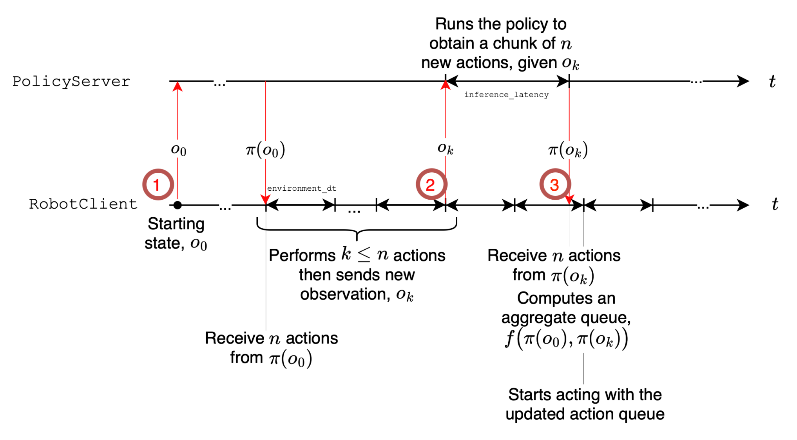    
异步推理流程如下:
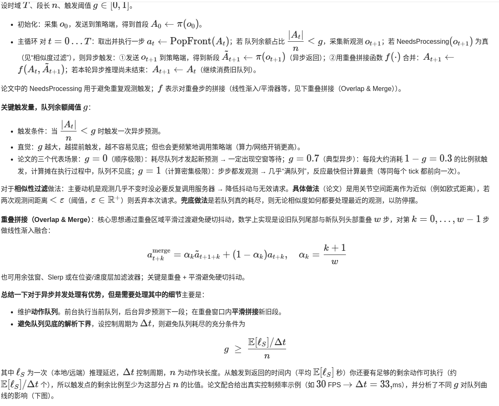
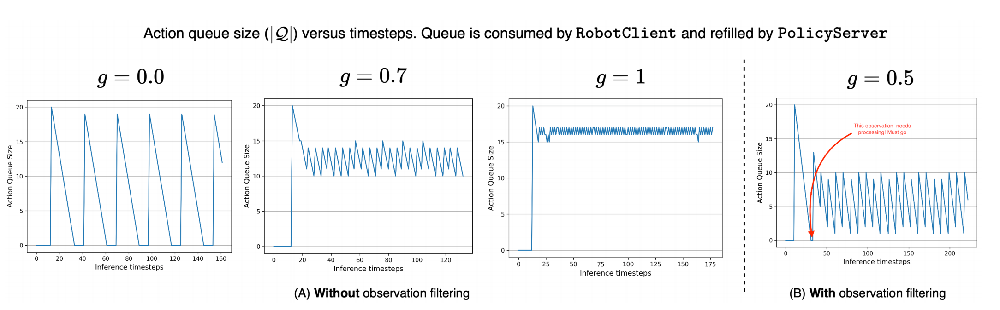
异步推理在架构上可以分为两个部分：

RobotClient（机器人端）：以控制周期$\Delta t$持续下发队列头部动作；本地维护动作队列$A_t$与触发逻辑；可做相似度过滤（见下节）。
PolicyServer（策略端）：接收观测$o_t$，运行策略$\pi$预测新队列$\widetilde{A}_{t+1}$后返回；可放在更强的远端算力（GPU/工作站/云）。
代码中**actions_per_chunk**即为action queue size，**chunk_size_threshold**即为g
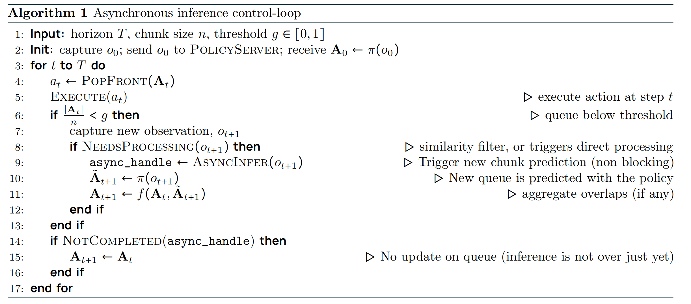

## Real-Time Chunking(RTC) 
RTC主要工作原理是即算法在执行前一个动作块的同时生成下一个动作块，冻结因推理延迟而必然执行的动作，并对剩余部分进行“图像修复”操作    
比如从一个动作分块策略开始，记作$\pi(A_t | o_t)$，其中$A_t=(a_t,a_{t+1},...,a_{a+H+1})$是未来动作的一个分块，$o_t$是观测值，t是控制器的时间步，H是预测视野。
基于流策略中生成动作块时，首先从标准高斯分布中采样随机噪声$A^0_t$，然后，使用如下所示的更新规则从 $\tau$ =0 到 1 对流的速度场$v_{\pi}$(一个经过学习的神经网络)进行积分，此过程定义如下：
$$
A^{\tau + \frac{1}{n}}_t = A^{\tau}_t + \frac{1}{n}v_{\pi}(A^\tau_t,o_t,\tau)
$$
为实现实时策略，必须首先引入异步推理机制：提前启动推理过程，使其与动作执行并发进行，定义$d = [\delta / \Delta t]$ 并将该量称为推理延迟，对应于从接收到$o_t$到获得动作块$\mathbf{A}_{t}$之间的时间间隔，由于策略在生成$A_{s-d}$ 时无法预知 s-d 至 s 时间段内的状态变化，动作序列$a_{s-1|0}$ 与$a_{s|s-d}$ 间的过渡点可能出现任意阶跃式突变，甚至超出分布范围，类似于执行时限过短的情况，该策略会导致动作顿挫现象，且延迟越高顿挫越剧烈
具体参见下图，这是连续两个块之间典型分叉的一个示例。推理在第 3 步和第 4 步之间开始。正在执行的原始块 {$a_t$}（黑色）计划从障碍物上方通过，而新生成的块 {$a^{\prime}_t$}（红色）则计划从下方通过。然而，{$a^{\prime}_t$} 要到 7 步之后的  时刻才可用
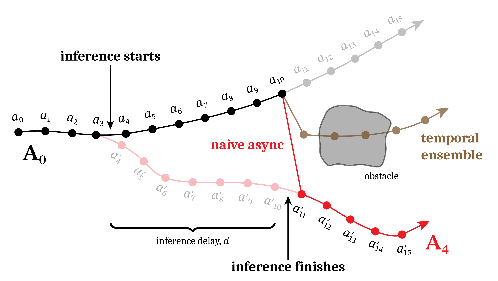
一个简单的异步算法可能会从 $a_{10}$ 跳转到$a_{11}^{\prime}$，从而导致非常高的、超出分布的加速度——即机械臂突然剧烈抖动到某个位置
————
至于**时间集成temporal ensemble**(棕色)，即在块之间进行插值，可以减少加速度，但会产生较差的动作。
因此，将这些动作“冻结”为已知会被执行的值是合理的；作者的目标是在保证该冻结前缀一致性的前提下，补全新分块的剩余部分(如上图的a11-a15，如下图的a4-a10)，这类似于修复一幅被移除部分的图像。
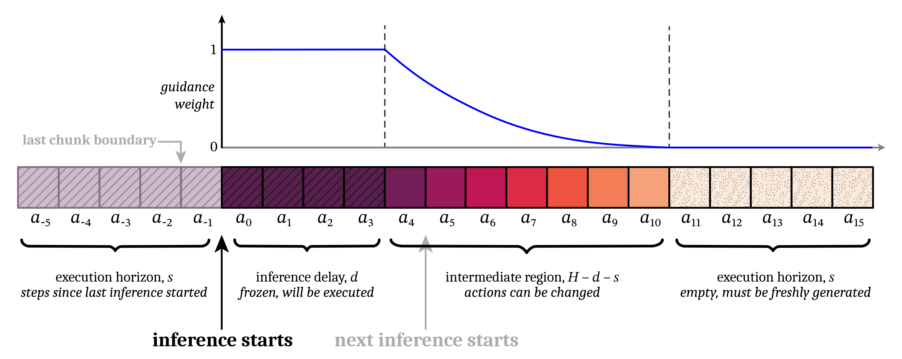
简言之，软掩码就像在两段动作间加了个“缓冲带”，让动作接得更自然，举个例子：假设预测范围H=16，执行范围s=5，延迟d=4
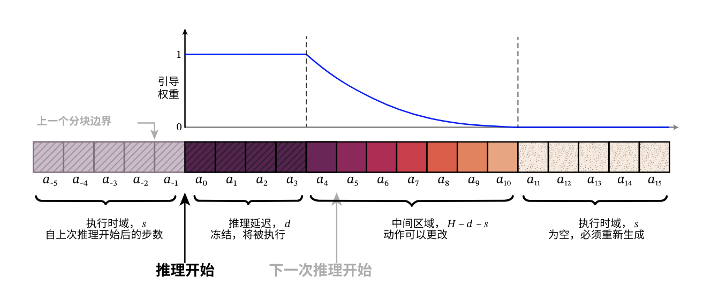
- RTC会给前4个动作(即图中的$a_0$到$a_3$，已执行)的权重1，完全冻结；
- 接下来的7个动作(即$a_4$到$a_{10}$，可能执行)的权重从1逐渐降到0；
- 最后5个动作(即$a_{11}$到$a_{15}$，全新生成)的权重是0

这样，新分块在点火柴时会更“尊重”前一段的划火柴动作，慢慢过渡到点燃蜡烛，而不是突然换个策略   
### Soft Masking (软掩码):
为了解决拼接处的跳变（Jerky movements）， 定义了一个权重矩阵W
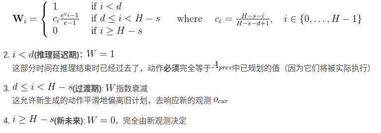
### Guidance Gradient (引导梯度)
我们把其中的下面这部分定义为引导项g——它将引导新块的生成 本质实则就是引导去噪了，然后将其一拆为二
$$
g = (Y - \hat{A}^1_t)^T diag(W)\frac{\partial{\hat{A}^1_t}}{\partial A^{\tau}_t}
$$
第一步，先算加权误差项
$$
e = (Y - \hat{A}^1_t)^T diag(W)
$$
这里的Y是目标——即上一块的动作$A_{\text {prev }}$相当于计算当前(最新)生成的估计值$\hat{A}^1_t$——如上文提到过的，$\widehat{\mathbf{A}_{t}^{1}}$是最终完全去噪动作片段的估计，与上一块$A_{prev}$的差异』       
第二步，再算Vector-Jacobian Product
$$
g = e\frac{\partial{\hat{A}^1_t}}{\partial A^{\tau}_t}
$$

### Integration (更新)  
将模型预测的速度场$v_\pi$加上引导梯度 g（受$\beta$裁剪限制）
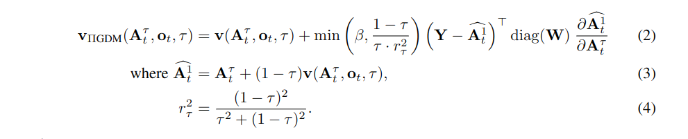
## 训练调整参数

```shell
 'scheduler': {'decay_lr': 2.5e-06, #衰减终值学习率
               'num_decay_steps': 30000,  #衰减步数
               'num_warmup_steps': 1000, #预热步数
               'peak_lr': 0.0001,  #峰值学习率
               'type': 'cosine_decay_with_warmup'},
```


## 参考文献
- [深入理解SmolVLA中的Flow Matching Action Expert：从理论到实现](https://blog.csdn.net/jiaquan3011/article/details/149692907)
- [smolvla.pdf](docs/smolvla.pdf)
- [FLow_Matching.pdf](docs/FLow_Matching.pdf)
- [轻量SmolVLA：半层VLM、视觉压缩与异步推理赋能具身智能](https://www.laumy.tech/2723.html/smolvla/)
